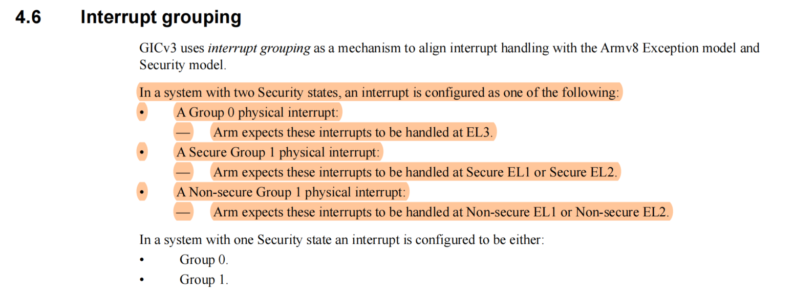

# GIC

## 中断分类

- LPI（Locality-specific Peripheral Interrupt）

- PPI（Private Peripheral Interrupt）

- SPI（Shared Peripheral Interrupt）

- SGI（Software Generated Interrupt）

## 中断分组

三种分组类型：

- Group 0

- Secure Group 1

- Non-secure Group 1

分组的意义：

- Signaling `Group 0` physical interrupts to the target PE using the FIQ exception request.

- Signaling Group 1 physical interrupts to the target PE in a manner that allows them to be handled using the IRQ handler in their own Security state. **The exact handling of Group 1 interrupts depends on the current Exception level and Security state, as described in Chapter 4 Physical Interrupt Handling and Prioritization.**

文档截图：

