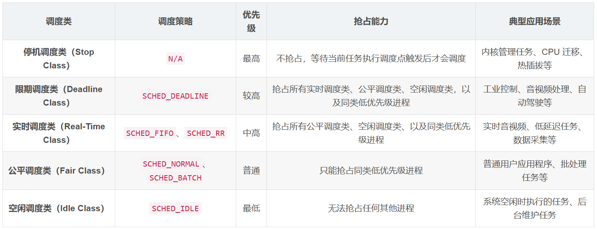

# Lockups & Hungtask

## Hungtask

### 目标

检测**整个系统中**是否有task_struct长时间未被调度

### 原理

内核启动阶段初始化了一个名为`khungtaskd`的内核线程，该内核线程通过`schedule_timeout_interruptible(timeout)`每隔`timeout`唤醒一次，醒来后遍历系统上所有的进程，检查是否存在处于D状态超过120s(时长可以设置)的进程，如果存在，则打印相关警告和进程堆栈。如果配置了`hung_task_panic`（proc或内核启动参数），则直接发起panic。

```c
hung_task_init
  kthread_run(watchdog, "khungtaskd")

watchdog
  while (1)
    check_hung_uninterruptible_tasks(120)
    schedule_timeout_interruptible(timeout)
```

## Softlockup和Hardlockup

### 目标

- Softlockup：检测**特定cpu上**是否长时间未发生调度

- HardLockup：检测**特定cpu**上是否长时间关中断

### 原理

#### softlockup

Soft lockup最核心的检测机制是利用高精度计时器hrtimer和停机调度机制stop_machine完成的。

- Soft lockup会在每个核心上都会启用一个hrtimer，该hrtimer以4s(即1/5软锁阈值)为采样周期，产生一个硬中断，硬中断处理函数中会调用到`watchdog_timer_fn()`，其中：
  
  - 先通过stop_one_cpu_nowait来请求本CPU的停机调度线程migration执行时间戳打点操作
  
  - 随后，硬中断检测距离上一次打点是否超过20s，如果超过则报Soft lockup警告。检测位置就在`watchdog_timer_fn()`中

- 每次hrtimer的处理函数中，通过stop_machine机制中完成喂狗操作
  
  - `softlockup_fn()`

> 首先了解migration进程是什么。
> 
> - migration是一个停机调度进程，每个cpu都有一个，其是整个系统中最高优先级的进程，具备自停车(self parking)特性。虽然其有最高优先级，但不直接抢占进程，而是等待当前CPU进入下一个调度点时，按优先级调度该进程。其没有时间片的概念，只要不主动让出cpu，其将一直霸占cpu。
> 
> 如果说migration这个最高优先级的进程都无法被正常调度，说明该cpu处于某种异常的状态，导致始终无法调度task。此时可能得原因有：
> 
> - 长时间关抢占，无法调度进程
> 
> - 中断执行久、中断嵌套多、中断风暴等，无法调度进程
> 
> - 锁异常，如spinlock持锁过久(也是关了抢占)，死锁等

#### 基于NMI Perf的hardlockup

这种方式基于hrtimer和NMI的perf事件实现的，具体方式是这样的：

- 当PMU计数器溢出时触发将产生一个perf事件。
  
  - 该perf事件会导致一个NMI中断，该NMI中断会触发一次Hard lockup检测
    
    - 检测的依据是watchdog_timer_fn中的某些计数、赋值操作（不同版本具体实现不一样）

- hrtimer的中断处理函数`watchdog_timer_fn()`中完成喂狗

#### 基于Buddy CPU的hardlockup

v6.4后引入的新机制

### 配置

/proc/sys/kernel/下的各种watchdog分析：

```c
/*
 * /proc/sys/kernel/watchdog
 */
int proc_watchdog(struct ctl_table *table, int write, void __user *buffer, size_t *lenp, loff_t *ppos)

/*
 * /proc/sys/kernel/nmi_watchdog
 */
int proc_nmi_watchdog(struct ctl_table *table, int write, void __user *buffer, size_t *lenp, loff_t *ppos)

/*
 * /proc/sys/kernel/soft_watchdog
 */
int proc_soft_watchdog(struct ctl_table *table, int write, void __user *buffer, size_t *lenp, loff_t *ppos)

/*
 * /proc/sys/kernel/watchdog_thresh
 */
int proc_watchdog_thresh(struct ctl_table *table, int write, void __user *buffer, size_t *lenp, loff_t *ppos)
```

更新操作都会执行到：

```c
proc_watchdog_common
  proc_watchdog_update
    lockup_detector_reconfigure
```

### 停机调度



## 参考文献

- https://blog.csdn.net/qq_37294304/article/details/142856029?utm_medium=distribute.pc_relevant.none-task-blog-2~default~baidujs_baidulandingword~default-0-142856029-blog-112004920.235^v43^pc_blog_bottom_relevance_base3&spm=1001.2101.3001.4242.1&utm_relevant_index=3