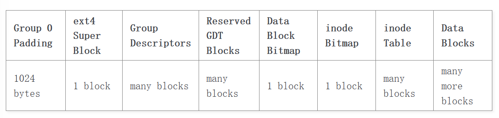

# Ext4

## 磁盘布局



- 每个块组为128MB

- Group 0开头预留了1024字节，用于x86 boot sector

- ext4正常情况仅使用Group 0中的Super Block和Group Descriptors

- 并不是所有Group都有冗余的Super Block和Group Descriptors
  
  - 不包含Super Block和Group Descriptors的Group以Data Block Bitmap开始

- ...

## Flexible Block Groups

灵活块组是指将`flex_bg size`个块组合并到一起，灵活块组中的第一个块组包含涵盖所有块组的Data Block Bitmap、Inode Bitmap、Inode Table。

灵活块组的好处是：

- 聚合元数据

- 保持大文件的连续性

## Meta Block Groups

默认情况下，Group 0中的Group Descriptors中保存了整个文件系统的所有块组信息，每个Group Descriptor为64字节。考虑到每个块组的大小为128MB，那么Group 0中可以保存的Group Descriptor数量最大为`128MB / 64B = (2 ^ 27) / (2 ^ 6) = 2 ^ 21`个，这就决定了最大文件系统大小为`(2 ^ 21) * 128MB = 256TB`。

元块组用于消除Group 0中保存了所有Group Descriptors的限制，每个元块组自己保存自己的Group Descriptors（元块组中的第一个块组保存主要使用的Group Descriptors，第二个和最后一个块组备份）。因此扩大了文件系统中可记录的Group Descirptors数量，从而增大了文件系统最大大小。

## Lazy Block Group Initialization

## Direct IO

```c
ext4_file_write_iter
  ext4_dio_write_iter
    inode_lock / inode_lock_shared
    ext4_dio_write_checks
      ext4_generic_write_checks
    iomap_dio_rw(ext4_iomap_ops, ext4_dio_write_ops)
      __iomap_dio_rw
        ext4_iomap_begin / ext4_iomap_overwrite_begin
        ...
        ext4_iomap_end
      iomap_dio_complete
    inode_unlock / inode_unlock_shared
```

## ext4磁盘分配算法

https://www.cnblogs.com/kanie/p/15359346.html

## 参考文献

https://docs.kernel.org/filesystems/ext4/overview.html

[https://www.cnblogs.com/alantu2018/p/8461272.html](https://www.cnblogs.com/alantu2018/p/8461272.html)

# jbd2

## 关键操作

### commit

- 所谓提交，就是把内存中transaction中的磁盘缓冲区中的数据写到磁盘的日志空间上。注意，jbd是将缓冲区中的数据另外写一份，写到日志上，原来的kernel将缓冲区写回磁盘的过程并没有改变。
- 在内存中，transaction是可以有若干个的，而不是只有一个。transaction可分为三种，一种是已经commit到磁盘日志中的，它们正在进行checkpoint操作；第二种是正在将数据提交到日志的transaction；第三种是正在运行的transaction。正在运行的transaction管理随后发生的handle，并在适当时间commit到磁盘日志中。注意正在运行的transaction最多只可能有一个，也可能没有，如果没有，则handle提出请求时，则会按需要创建一个正在运行的transaction。

### checkpoint

- 当一个transaction已经commit，那么，是不是在内存中它就没有用了呢？好像是这样，因为其中的数据已经写到磁盘日志中了。但是实际上不是这样的。主要原因是磁盘日志是个有限的空间，比如说100MB，如果一直提交transaction，很快就会占满，所以日志空间必须复用。
- 其实与日志提交的同时，kernel也在按照自己以前的方式将数据写回磁盘。试想，如果一个transaction中包含的所有磁盘缓冲区的数据都已写回到磁盘的原来的位置上（不是日志中，而是在磁盘的原来的物理块上），那么，该transaction就没有用了，可以被删除了，该transaction在磁盘日志中的空间就可以被回收，进而重复利用了。

### revoke

- 假设有一个缓冲区，对应着一个磁盘块，内核多次修改该缓冲区，于是磁盘日志中就会有该缓冲区的若干个版本的数据。假设此时要从文件中删除该磁盘块，那么，一旦包含该删除操作的transaction提交，那么，再恢复时，已经存放在磁盘日志中的该磁盘块的若干个版本的数据就不必再恢复了，因为到头来还是要删除的。revoke就是这样一种加速恢复速度的方法。当本transaction包含删除磁盘块操作时，就会在磁盘日志中写一个revoke块，该块中包含<被revoked的块号blocknr，提交的transaction的ID>，表示恢复时，凡是transaction ID小于等于ID的所有写磁盘块blocknr的操作都可以取消了，不必进行了。

### recover

- 加入日志机制后，一旦系统崩溃，重新挂载分区时，就会检查该分区上的日志是否需要恢复。如果需要，则依次将日志空间的数据写回磁盘原始位置，则文件系统又重新处于一致状态了。

## 关键数据结构

| 结构体                 | 类型            | 作用         |
| ------------------- | ------------- | ---------- |
| jbd2_journal_handle | handle_t      | 表示一个原子操作   |
| transaction_s       | transaction_t | 表示一个事务     |
| journal_s           | journal_t     | 表示一个日志系统实例 |
|                     |               |            |
