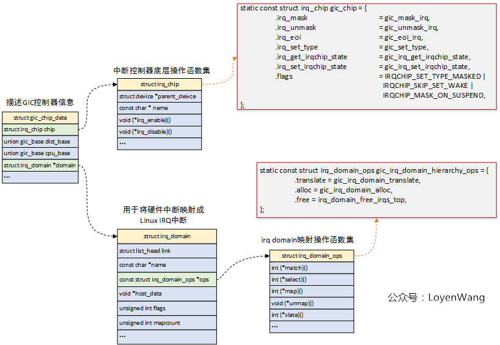
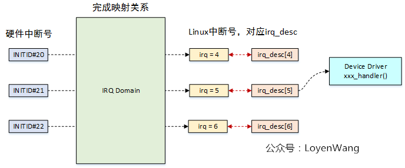

# 中断框架

## irq_chip

描述并屏蔽一款中断控制器的底层硬件细节：



### 配置接口

```c
irq_set_chip_and_handler
```

## irq_domain

用于将硬件中断号和Linux IRQ中断号（virq、虚拟中断号）之间的映射：



每个`struct irq_chip`都对应一个`struct irq_domain`。

## request_irq

```c
request_irq
  request_threaded_irq
    irq_desc = irq_to_desc(irq)                                    // 通过表或树查找irq对应的irq_desc结构体
    irqaction = kzalloc
    irqaction->handler = handler
    irqaction->thread_fn = thread_fn
    irq_chip_pm_get                                                // irq_chip上电
    __setup_irq(irq, irq_desc, irqaction)
      irq_desc->irq = irq
      setup_irq_thread                                             // 如果指定了thread_fn
      mutex_lock(irq_desc->request_mutex)
      chip_bus_lock(irq_desc)
      irq_request_resources                                        // if (!irq_desc->action)，即第一次设置该irq_desc
      raw_spin_lock_irqsave(irq_desc->lock)
      init_waitqueue_head(irq_desc->wait_for_threads)
      irq_activate(irq_desc)
        irq_desc_get_irq_data
        irq_domain_activate_irq
      raw_spin_unlock_irqsave(irq_desc->lock)
      chip_bus_sync_unlock(irq_desc)
      mutex_unlock(irq_desc->request_mutex)
      register_irq_proc                                            // /proc/irq/<irq>/.../...
      register_handler_proc                                        // /proc/irq/<irq>/handler/...
```


