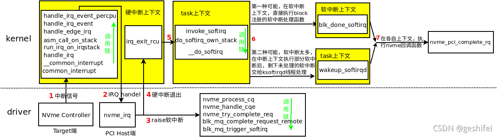

# Nvme

## Nvme IO初始化

1. 对admin_tagset结构进行初始化，特别是nvme_mq_admin_ops的赋值

2. 调用blk_mq_alloc_tag_set分配tag set并与request queue关联

3. 然后调用blk_mq_init_allocated_queue对hardware queue和software queue进行初始化，并配置两者之间的mapping关系，最后将返回值传递给dev->ctrl.admin_q

## Nvme IO下发

```c
blk_mq_make_request
  ... ...
```

## Nvme IO完成



## 参考文献

[linux block layer第二篇bio 的操作 - geshifei - 博客园](https://www.cnblogs.com/kernel-dev/p/17306812.html)

# LVM

## device mapper创建

```c
ioctl(DM_DEV_CREATE_CMD)
  dev_create
    dm_create
      alloc_dev
        md->queue = blk_alloc_queue_node(GFP_KERNEL, numa_node_id)
        blk_queue_make_request(md->queue, dm_make_request)                // 设置queue的处理函数
        md->disk = alloc_disk_node()
        add_disk_no_queue_reg
```

## device mapper队列初始化

```c
dm_setup_md_queue
  mapped_device.tag_set = kzalloc_node()
  mapped_device.tag_set.ops = &dm_mq_ops
  mapped_device.tag_set.nr_hw_queue = dm_get_blk_mq_nr_hw_queues()
```

# blk-mq

## 队列创建

队列创建前半部分（准备tags等）：

```c
nvme_dev_add
  nvme_dev.tagset.ops = &nvme_mq_ops
  nvme_dev.tagset.nr_hw_queues =
  nvme_dev.tagset.nr_maps =
  ... ...
  nvme_dev.tagset.numa_node =
  nvme_dev.tagset.queue_depth =
  ... ...
  blk_mq_alloc_tag_set(&nvme_dev.tagset)
    blk_mq_tag_set.tags = kcalloc_node(nr_hw_queues())                // 分配blk_mq_tags指针数组，每个硬件队列一个元素
    blk_mq_tag_set.map[i].mq_map = kcalloc_node(nr_cpus_ids)          // i代表映射表类型；mq_map为映射表，下标为软件队列index，值为硬件队列index，因此mq_map个数为软件队列个数
    blk_mq_update_queue_map(blk_mq_tag_set)                           // 更新填充映射表内容
    blk_mq_alloc_rq_maps                                              // 分配blk_mq_tags指针数组指向的元素
      __blk_mq_alloc_rq_maps
        __blk_mq_alloc_rq_map
          blk_mq_tag_set.blk_mq_tags[hctx_idx] = blk_mq_alloc_rq_map
            blk_mq_init_tags                                          // 分配实际的blk_mq_tags内存
            blk_mq_tags.rqs = kcalloc_node(nr_tags)                   // 分配blk_mq_tags中的request指针数组
          blk_mq_alloc_rqs                                            // 分配blk_mq_tags中的request指针数组指向的request
```

```c
blk_alloc_queue_node
  q = kmem_cache_alloc_node
  
```
