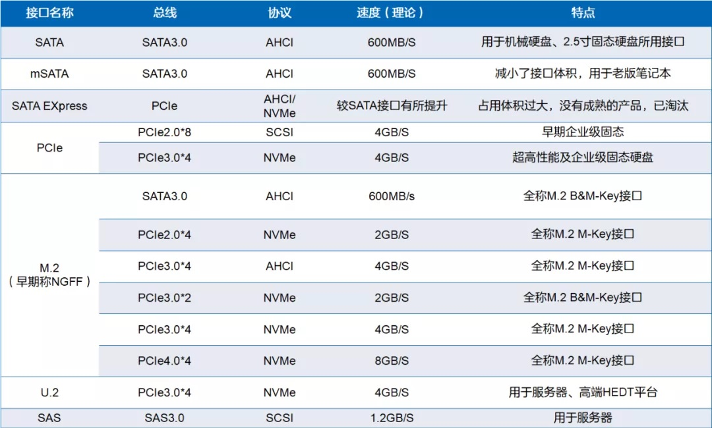
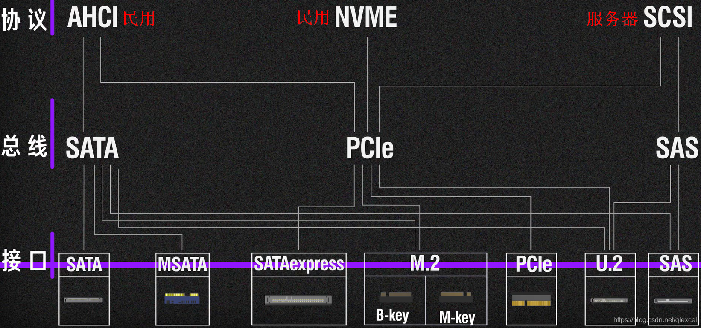
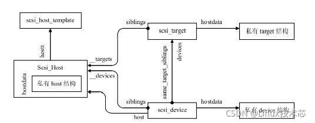
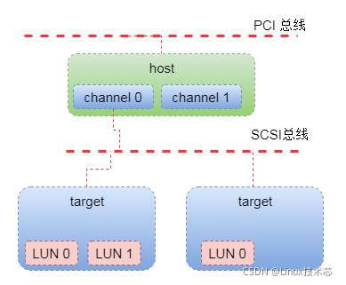
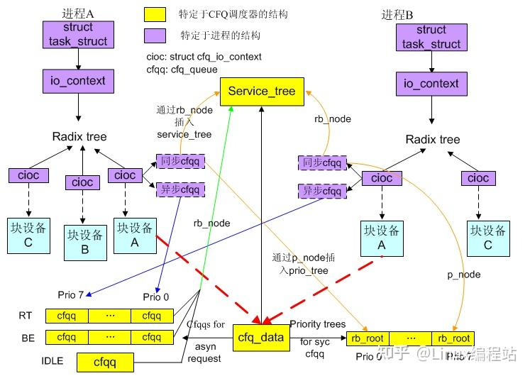

# IO协议层次






# Nvme

## Nvme IO初始化

1. 对admin_tagset结构进行初始化，特别是nvme_mq_admin_ops的赋值

2. 调用blk_mq_alloc_tag_set分配tag set并与request queue关联

3. 然后调用blk_mq_init_allocated_queue对hardware queue和software queue进行初始化，并配置两者之间的mapping关系，最后将返回值传递给dev->ctrl.admin_q

## Nvme IO下发

```c
blk_mq_make_request
  ... ...
```

## Nvme IO完成

```c
nvme_irq
  nvme_process_cq
  nvme_complete_cqes
    nvme_handle_cqe
      nvme_end_request
        blk_mq_complete_request
          __blk_mq_complete_request
            ... request_queue->mq_ops->complete() / nvme_pci_complete_rq    // 这里分三种情况，但最终都是调用complete回调
              nvme_complete_rq
                blk_mq_end_request
                  blk_update_request
                    req_bio_endio
                      bio_endio
                  __blk_mq_end_request
```

## 参考文献

[linux block layer第二篇bio 的操作 - geshifei - 博客园](https://www.cnblogs.com/kernel-dev/p/17306812.html)

# SCSI

## SCSI架构


Linux内核对SATA的实现有点坎坷，其将SATA硬盘作为SCSI硬盘实现，libata作为scsi和sata之间的转换层：


另一张图中，猜测ATA Bridge应该处于SCSI Lower Level？是的！


引用：

三层结构：

- The top layer handles operations for a class of device. For example, the sd (SCSI disk) driver is at this layer; it knows how to translate requests from the kernel block device interface into disk-specific commands in the SCSI protocol, and vice versa.

- The middle layer moderates and routes the SCSI messages between the top and bottom layers, and keeps track of all of the SCSI buses and devices attached to the system.

- The bottom layer handles hardware-specific actions. The drivers here send outgoing SCSI protocol messages to specific host adapters or hardware, and they extract incoming messages from the hardware. The reason for this separation from the top layer is that although SCSI messages are uniform for a device class (such as the disk class), different kinds of host adapters have varying procedures for sending the same messages.

备注：

The top and bottom layers contain many different drivers, but it’s important to remember that, for any given device file on your system, the kernel uses one top-layer driver and one lower-layer driver. For the disk at /dev/sda in our example, the kernel uses the sd top-layer driver and the ATA bridge lower-layer driver.

There are times when you might use more than one upper-layer driver for one hardware device (see 3.6.3 Generic SCSI Devices). For true hardware SCSI devices, such as a disk attached to an SCSI host adapter or a hardware RAID controller, the lower-layer drivers talk directly to the hardware below. However, for most hardware that you find attached to the SCSI subsystem, it’s a different story.

目前很少有底层直接使用SCSI设备的情况了，大部分情况是底层使用SATA设备。

> 对于SAS盘，中间的转换库不是libata，而是libsas。

## SCSI数据结构



### Scsi_Host与scsi_host_template

Scsi_Host表示一个主机适配器，包含两部分，一部分在Middle Layer中使用，另一部分在Bottom Layer中使用。

scsi_host_template抽象公共部分，包括各操作函数指针集合。

当PCI子系统通过ID匹配，或者手工方式，添加一个SCSI主机适配器时，SCSI低层驱动便分配一个Scsi_Host描述符。当系统中有多个SCSI主机适配器时，系统中就存在多个Scsi_Host描述符。

在分配好SCSI主机适配器描述符后，将它添加到系统中，然后启动探测过程。探测到的scsi_target通过siblings链入主机适配器以_targets为表头的链表。而探测到的scsi_device将host域指向该主机适配器，而且一方面通过siblings链入主机适配器以_devices为表头的链表，另一方面通过same_target_siblings链入SCSI目标节点以devices为表头的链表。SCSI目标节点描述符和SCSI设备描述符各自有为SCSI低层驱动专用的信息，都通过hostdata域指向它们。

SCSI各个核心结构的关系。一般来说一种类型的SCSI低层驱动可以驱动多个SCSI主机适配器。每个主机适配器可以挂接多个SCSI目标节点，每个目标节点中至多可以有多个逻辑设备。对于SCSI并行接口，目标节点数最多为7或15，这取决于SCSI总线的宽度，对于SCSI磁盘，逻辑设备数最多为8。



### scsi_target

表示一个目标节点，目标节点是指有一个逻辑单元或多个逻辑单元的目标设备。

### scsi_device

表示一个逻辑设备。

### scsi_cmnd

表示一个scsi命令

## SCSI子系统初始化

## SCSI IO下发

```c
blk_mq_dispatch_rq_list / __blk_mq_issue_directly
  scsi_queue_rq
    scsi_cmnd->scsi_done = scsi_mq_done
    scsi_dispatch_cmd
      Scsi_Host->scsi_host_template->queuecommand()
```

对于libsas，`->queuecommand`为`sas_queuecommand()`：

```c
sas_queuecommand
  sas_create_task
    sas_task = sas_alloc_task()                                                // 分配struct sas_task
    sas_task->scsi_cmnd = cmd
    sas_task->task_done = sas_scsi_task_done
  sas_internal->sas_domain_function_template->lldd_execute_task(sas_task)
```

## SCSI IO完成

从中断开始：

```c
vring_interrupt
  vq.callback / virtscsi_req_done
    virtscsi_vq_done
      fn / virtscsi_complete_cmd
        scsi_cmnd->scsi_done

scsi_cmnd->scsi_done() / scsi_mq_done                       
  blk_mq_complete_request
    __blk_mq_complete_request
      if (request_queue->nr_hw_queues == 1)
        __blk_complete_request                              // 如果硬盘只有一个队列，则只有一个irq，从而只有一个cpu来接收这个硬盘的中断，因此不能在硬中断上下文中做太多动作，转而使用软中断处理
          raise_softirq_irqoff(BLOCK_SOFTIRQ)
      else
        request_queue->mq_ops->complete()                   // nvme直接在硬中断上下文中处理

blk_done_softirq                                            // BLOCK_SOFTIRQ软中断的处理函数
  request_queue->mq_ops->complete() / scsi_softirq_done
    scsi_decide_disposition                                 // 错误恢复流程
    scsi_log_completion                                     // 超时打印在这里
    scsi_finish_command
      scsi_io_completion / scsi_io_completion_action
        scsi_end_request
          blk_update_request
          __blk_mq_end_request
        scsi_run_queue_async
```

## SCSI IO错误恢复

```c
scsi_decide_disposition
```

## 参考文献

[Linux Scsi子系统框架介绍 - 内核工匠 - 博客园](https://www.cnblogs.com/Linux-tech/p/13873882.html)

[深入浅出SCSI子系统（一）Linux 内核中的 SCSI 架构-CSDN博客](https://blog.csdn.net/sinat_37817094/article/details/120357371)

[深入浅出SCSI子系统（二）SCSI子系统对象-CSDN博客](https://blog.csdn.net/sinat_37817094/article/details/120541004)

[深入浅出SCSI子系统（三）SCSI子系统初始化_scsi初始化-CSDN博客](https://blog.csdn.net/sinat_37817094/article/details/120584214)

[深入浅出SCSI子系统（四）添加适配器到系统_深入浅出scsi子系统(四)添加适配器到系统-CSDN博客](https://blog.csdn.net/sinat_37817094/article/details/120585855)

[深入浅出SCSI子系统（五）SCSI设备探测_mpt属于scsi子系统吗?-CSDN博客](https://blog.csdn.net/sinat_37817094/article/details/120600710)

[深入浅出SCSI子系统（六）SCSI 磁盘驱动_scsi device-CSDN博客](https://blog.csdn.net/sinat_37817094/article/details/120447062)

[深入浅出SCSI子系统（七）SCSI命令执行_scsi lib-CSDN博客](https://blog.csdn.net/sinat_37817094/article/details/120611409)

# UFS

UFS作为SCSI的底层驱动来实现：


# LVM

## device mapper创建

```c
ioctl(DM_DEV_CREATE_CMD)
  dev_create
    dm_create
      alloc_dev
        md->queue = blk_alloc_queue_node(GFP_KERNEL, numa_node_id)
        blk_queue_make_request(md->queue, dm_make_request)                // 设置queue的处理函数
        md->disk = alloc_disk_node()
        add_disk_no_queue_reg
```

## device mapper队列初始化

```c
dm_setup_md_queue
  mapped_device.tag_set = kzalloc_node()
  mapped_device.tag_set.ops = &dm_mq_ops
  mapped_device.tag_set.nr_hw_queue = dm_get_blk_mq_nr_hw_queues()
```

# blk-mq

## 数据结构

1：`struct blk_mq_ctx`代表每个CPU独有的软件队列；
2：`struct blk_mq_hw_ctx`代表硬件队列，块设备至少有一个；
3：`struct blk_mq_tag`每个硬件队列结构struct blk_mq_hw_ctx对应一个；
4：`struct blk_mq_tag`主要是管理struct request(下文简称req)的分配。struct request大家应该都比较熟悉了，单队列时代就存在，IO传输的最后都要把bio转换成request；
5：`struct blk_mq_tag_set`包含了块设备的硬件配置信息，比如支持的硬件队列数nr_hw_queues、队列深度queue_depth等，在块设备驱动初始化时多处使用blk_mq_tag_set初始化其他成员；

## 队列创建

队列创建前半部分，主要分配：

- blk_mq_tag_set
  
  - blk_mq_tag_set.blk_mq_queue_map[i].mq_map，软硬队列的映射表，i表示类型HCTX_MAX_TYPES，mq_map是一个数组，下标为cpu/软件队列编号，元素为对应硬件队列编号
  
  - blk_mq_tags，每个硬件队列一个
    
    - blk_mq_tags.rqs，request指针数组
    
    - blk_mq_tags.rqs.request，实际的request元素

```c
nvme_dev_add
  nvme_dev.tagset.ops = &nvme_mq_ops
  nvme_dev.tagset.nr_hw_queues =
  nvme_dev.tagset.nr_maps =
  ... ...
  nvme_dev.tagset.numa_node =
  nvme_dev.tagset.queue_depth =
  ... ...
  blk_mq_alloc_tag_set(&nvme_dev.tagset)
    blk_mq_tag_set.tags = kcalloc_node(nr_hw_queues())                // 分配blk_mq_tags指针数组，每个硬件队列一个元素
    blk_mq_tag_set.map[i].mq_map = kcalloc_node(nr_cpus_ids)          // i代表映射表类型；mq_map为映射表，下标为软件队列index，值为硬件队列index，因此mq_map个数为软件队列个数
    blk_mq_update_queue_map(blk_mq_tag_set)                           // 更新填充映射表内容
    blk_mq_alloc_rq_maps                                              // 分配blk_mq_tags指针数组指向的元素
      __blk_mq_alloc_rq_maps
        __blk_mq_alloc_rq_map
          blk_mq_tag_set.blk_mq_tags[hctx_idx] = blk_mq_alloc_rq_map
            blk_mq_init_tags                                          // 分配实际的blk_mq_tags内存
            blk_mq_tags.rqs = kcalloc_node(nr_tags)                   // 分配blk_mq_tags中的request指针数组
          blk_mq_alloc_rqs                                            // 分配blk_mq_tags中的request指针数组指向的request
```

队列创建后半部分，在 blk_mq_init_queue()中完成。该函数主要分配块设备的运行队列request_queue，接着分配每个CPU专属的软件队列并初始化，分配硬件队列并初始化，然后建立软件队列和硬件队列的映射。

```c
nvme_alloc_admin_tags
  blk_mq_init_queue
    blk_alloc_queue_node
      q = kmem_cache_alloc_node
      bioset_init(&q->bio_split)
      q->backing_dev_info = bdi_alloc_node()
      blkcg_init_queue
    blk_mq_init_allocated_queue
      blk_mq_alloc_ctx                                // 分配per cpu的软件队列
        blk_mq_ctxs = kzalloc()
        ctxs->queue_ctx = alloc_percpu                // 分配blk_mq_ctxs结构体中per cpu的blk_mq_ctx
        request_queue->queue_ctx = ctxs->queue_ctx    // request_queue中软件队列的来源就是blk_mq_ctxs->queue_ctx
      blk_mq_sysfs_init
      request_queue->queue_hw_ctx = kcalloc_node()    // 分配硬件队列指针数组，硬件队列的个数由驱动定义
      blk_mq_realloc_hw_ctxs                          // 分配硬件队列元素
      blk_queue_make_request(blk_mq_make_request)     // 设置make_request_fn
      blk_mq_init_cpu_queues
      blk_mq_map_swqueue                              // 完成软件队列和硬件队列的映射关系
      elevator_init_mq                                // 初始化io调度器
```

## 请求处理

```c
blk_mq_make_request
  
```

# blkio cgroup

## 限速

```c
blkio
```

# CFQ调度器

## 描述调度器相关的数据结构

- `struct cfq_data`
  
  - 描述调度器本身

- `struct cfq_queue`
  
  - 描述调度队列

## 描述进程相关的数据结构

- `struct io_context`
  
  - 核心结构是一个基数树，里面组织了进程所访问的所有块设备所对应的`struct cfq_io_context`

- `struct cfq_io_context`
  
  - 核心结构是两个队列，也就是进程在一个CFQ调度器所关系到的队列，一个是同步的，一个是异步的

图示：



## 参考资料

- https://blog.51cto.com/alanwu/1393078

- 一个IO的传奇一生系列 https://zhuanlan.zhihu.com/p/669010858
