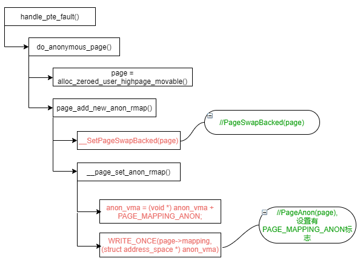
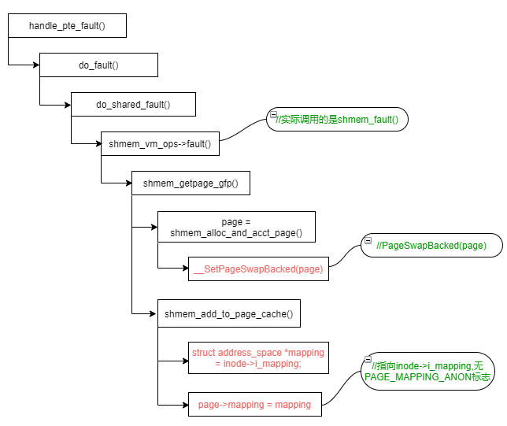
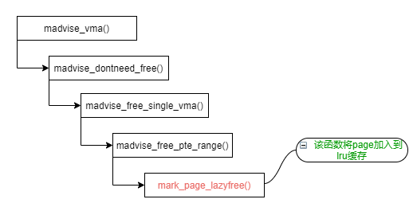
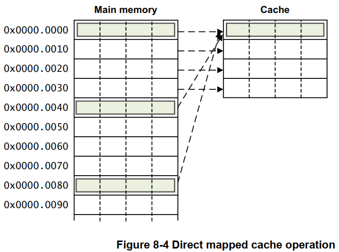
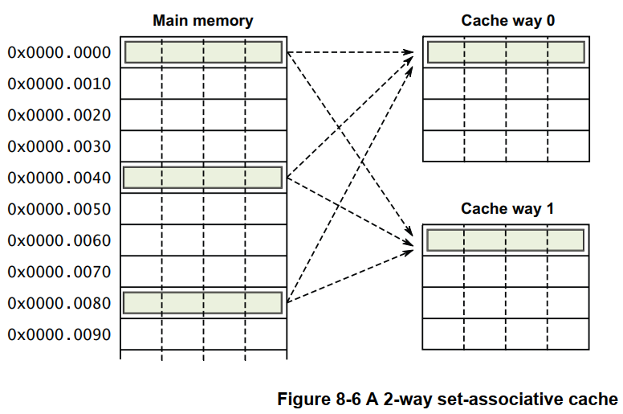

# 内存管理

## Intel页表

```
-
```

## 未解压时的页表

建立页表的代码在arch/x86/boot/compressed/head_64.S:startup_32中，并开启了分页

```
  pgtable                         
  +------------------+            pgtable + 0x1000                
0 | pgtable + 0x1000 |----------->+------------------+            pgtable + 0x2000     
  +------------------+            | pgtable + 0x2000 |----------->+------------------+ 
1 |                  |            +------------------+            | 0x000000         | 2M / page
  +------------------+            | pgtable + 0x3000 |--------+   +------------------+
2 |                  |            +------------------+        |   | 0x200000         |
  +------------------+            | pgtable + 0x4000 |-----+  |   +------------------+
3 |                  |            +------------------+     |  |   | 0x400000         |
  +------------------+            | pgtable + 0x5000 |--+  |  |   +------------------+
  |                  |            +------------------+  |  |  |   | ... ...          |
  |                  |            |                  |  |  |  |   +------------------+
  |                  |            |                  |  |  |  |   |                  |
  |                  |            |                  |  |  |  |   |                  |
  +------------------+            |                  |  |  |  |   |                  |
                                  +------------------+  |  |  |   |                  |
                                                        |  |  |   +------------------+
                                                        |  |  |                        
                                                        |  |  |                        
                                                        |  |  |   pgtable + 0x3000
                                                        |  |  +-->+------------------+
                                                        |  |      |                  |
                                                        |  |      |                  |
                                                        |  |      |                  |
                                                        |  |      +------------------+
                                                        |  |       
                                                        |  |       
                                                        |  |      pgtable + 0x4000
                                                        |  +----->+------------------+
                                                        |         |                  |
                                                        |         |                  |
                                                        |         |                  |
                                                        |         +------------------+
                                                        |                            
                                                        |                            
                                                        |         pgtable + 0x5000
                                                        +-------->+------------------+
                                                                  |                  |
                                                                  |                  |
                                                                  |                  |
                                                                  +------------------+
```

## setup阶段的页表

该部分代码在arch/x86/kernel/head_64.S；部分是在该汇编文件中硬编码(即和指令混在一起，直接存在于二进制中)，部分是在__startup_64函数中操作；

其中，early_dynamic_pgts是一个恒等映射（物理地址和虚拟地址相等），仅用作加载early_top_pgtable动作完成到jmp到高地址之前的短暂过渡，其实只有几个指令而已；进入到start_kernel之前，该部分页表会被清空；

```
                                         early_dynamic_pgts[0]                     early_dynamic_pgts[1]
                                  +----->+-----------------------+       +-------->+-------------------+       
                                  |      | early_dynamic_pgts[1] |-------+         |                   |     
                                  |      +-----------------------+       |         |                   |     
                                  |      | early_dynamic_pgts[1] |-------+         +-------------------+       
    early_top_pgt                 |      +-----------------------+                 | 16MB              |  _text here
    +-----------------------+     |      |                       |                 +-------------------+
  0 | early_dynamic_pgts[0] |-----+      |                       |                 | 16MB + 2MB        |        
    +-----------------------+     |      |                       |                 +-------------------+
  1 | early_dynamic_pgts[0] |-----+      +-----------------------+                 |                   |     
    +-----------------------+                                                      ~                   ~
    |                       |                                                      |                   |
    |                       |                                                      +-------------------+
    |                       |                                                      | 30MB              |  _end here
    |                       |                                                      +-------------------+
    |                       |                                                      |                   |
    |                       |                                                      |                   |
    |                       |                                                      +-------------------+
    |                       |            
    |                       |            
    +-----------------------+            level3_kernel_pgt                         level2_kernel_pgt
511 | level3_kernel_pgt     |----------->+-----------------------+         +------>+-------------------+  --+--
    +-----------------------+            |                       |         |       | 0x000000          |    |
                                         |                       |         |       +-------------------+    |
                                         |                       |         |       | 0x200000          |    |
                                         |                       |         |       +-------------------+    |
                                         |                       |         |       | 0x400000          |
                                         |                       |         |       +-------------------+  512MB total, 2MB per page
                                         |                       |         |       |                   |
                                         |                       |         |       |                   |    |
                                         |                       |         |       +-------------------+    |
                                         |                       |         |   255 | 0x1fe00000        |    |
                                         |                       |         |       +-------------------+  --+--
                                         |                       |         |       |                   |
                                         |                       |         |       |                   |
                                         +-----------------------+         |       +-------------------+
                                     510 | level2_kernel_pgt     |---------+       |                   |
                                         +-----------------------+                 +-------------------+
                                     511 | level2_fixmap_pgt     |---------+       |                   |
                                         +-----------------------+         |       +-------------------+
                                                                           |
                                                                           |
                                                                           |       level2_fixmap_pgt           level1_fixmap_pgt
                                                                           +------>+-------------------+   +-->+--------------------+
                                                                                   |                   |   |   |                    |
                                                                                   |    not filled     |   |   |                    |
                                                                                   |                   |   |   |                    |
                                                                                   +-------------------+   |   |   not filled       |
                                                                               506 | level1_fixmap_pgt |---+   |                    |
                                                                                   +-------------------+       |                    |
                                                                                   |    not filled     |       |                    |
                                                                                   +-------------------+       +--------------------+
```

## 直接映射的建立

kernel image映射的复制：

```c
x86_64_start_kernel
  reset_early_page_table
    memset(early_top_pgt, 0, sizeof(pgd_t) * (PTRS_PER_PGD - 1))      // 这里留下了第511项
    next_early_pgt = 0
    write_cr3(__sme_pa_nodebug(early_top_pgt))                        // 这里对cr3的写应该是为了flush tlb和page entry cache
  init_top_pgt[511] = early_top_pgt[511]                              // 复制第511项的指针
```

代码在setup_arch中的init_mem_mapping，用于从虚拟地址空间的PAGE_OFFSET处直接映射所有的物理内存

```c
-
```

## page结构体的建立

```c
setup_arch
  e820__memblock_setup                                     // 将e820表中的所有内存区域全部初始化到memblock系统中
  init_mem_mapping                                         // 建立direct mapping
  initmem_init                                             // 配置memblock的numa信息
  x86_init.paging.pagetable_init / paging_init
    sparse_memory_present_with_active_regions
    sparse_init                                            // 创建vmemmap映射
    zone_sizes_init
```

## buddy system中内存页的来源

```c
-
```

## 页表头文件梳理

```c
asm/pgalloc.h -> asm-generic/pgalloc.h
```

## fork相关的内存过程

参见fork.md

## 内存分配与回收


## 缺页处理

v6.6，x86_64：

```c
handle_page_fault
  do_user_addr_fault
    handle_mm_fault                            // On entry, we hold either the VMA lock or the mmap_lock (FAULT_FLAG_VMA_LOCK tells you which).
      __handle_mm_fault
        handle_pte_fault
          do_pte_missing
```

## 参考文献

[内存初始化](https://zhuanlan.zhihu.com/p/613004422)

[内存模型](http://www.wowotech.net/memory_management/memory_model.html)

[Page Flags](https://zhuanlan.zhihu.com/p/590669353)

http://linux.laoqinren.net/kernel/shrink_lruvec/

# 匿名页判断

## PageAnon(page) && PageSwapBacked(page)

说明该page是一个标准的匿名页，其page->mapping指向对应的vma->anon_vma：



## !PageAnon(page) && PageSwapBacked(page)

shmem的情况：



## PageAnon(page) && !PageSwapBacked(page)

这是一种比较特殊的情况，称为lazyfree pages，这种pages是通过madvise()对匿名页设置了MADV_FREE形成的。  关于MADV_FREE相关的情况具体参考：https://man7.org/linux/man-pages/man2/madvise.2.html  

不过要形成PageAnon(page) && !PageSwapBacked(page)这种状态并非一蹴而就，而是分两个阶段：  

### MADV_FREE

将page加入到lazyfree缓存链表this_cpu_ptr(&lru_pvecs.lru_lazyfree)中，如下流程图所示：



### 清除PG_swapbacked标记

清除lazyfree pages PG_swapbacked标志的点有两个：  

- lazyfree lru缓存链表满或者PageCompound(page)的情况

- 内存紧张进行回收时的情况

这两种情况都会调用lru_lazyfree_fn()函数来将lazyfree lru缓存链表上的page转移到lru链表上：


## 内核注释

参见`include/linux/page-flags.h`中对各标记的解释：

> PG_swapbacked is set when a page uses swap as a backing storage.  This are usually PageAnon or shmem pages but please note that even anonymous pages might lose their PG_swapbacked flag when they simply can be dropped (e.g. as a result of MADV_FREE).

# Cache

## Cache架构

### 直接映射（Direct Mapped）

只有`一路Cache`，即`1-Way Cache`：



### 多路组相连（N-Way Set Associate）

现代Cache实现的主流方式：



### 全相联（Fully Associate）

每Way中只有一个Set的多路组相连

## Cache问题

### Cache歧义

定义：一个VA映射到不同的PA，在VIVT下会`将不同PA的数据映射到同一个缓存行`，但VIVT无法辨别该缓存行中的数据属于哪个PA。

场景：典型的场景是进程切换，进程1的VA映射到PA1，进程2的VA映射到PA2。

危险：此时如果使用`VIVT`时，Cache无法通过`Tag区域`辨别VA对应缓存行中的数据对应哪个PA。进而导致读到错误的数据。

`VIPT`和`PIPT`不存在Cache歧义问题（因为此时Tag来自于PA）。

### Cache别名

定义：多个不同的虚拟地址 (VA1,VA2,…) ，如果映射到同一个物理地址PA(如不同进程间的共享内存)，可能导致 `同一PA的数据映射到多个不同的Cache行`的情形，就是所谓的 `Cache别名`。

危险：`Cache 别名` 会导致 `Cache 浪费`，以及`潜在的数据不一致性`。

`PIPT`不存在Cache别名问题。

- 第一类Cache别名问题是由`VIVT`下`Cache Index的不唯一性`引发的 。假设有一个`8KB的直接映射(Direct Mapped)`的Cache，那么Cache查找的`Index + Offset`两部分需要`13-bit`；同时假定内存系统采用`4KB`大小的页面，那么页面内偏移需要`12-bit`。当`VA1,VA2映射到同一PA`时，则一定有`VA1[11:0]==VA2[11:0] (即 页面内偏移位置相同)`，但`VA1[12]==VA2[12] 则不一定成立`；如果`VA1[12] != VA2[12]`，则意味着`VA1 和 VA2 的 Index 值不同 (VA[12]是Index的一位)`，所以`VA1和VA2会占据两个不同的 Cache 行`。

- 第二类Cache 别名问题是由`VIVT`下`Cache Tag 的不唯一性`引发的。假设有一个`8KB两路组相联`的Cache，Cache查找的`Index + Offset`两部分需要`12-bit`。当`VA1,VA2映射到同一PA`时，则一定有`VA1[11:0]==VA2[11:0] (即 页面内偏移位置相同) `，也即 `VA1,VA2 Cache 查找的 Index 是相等的，这意味着 VA1,VA2 的 Cache 行位于同一组(Set)，但同时由于 VA1 != VA2，所以 VA1 和 VA2 的 Cache Tag 值不相等，这样 VA1,VA2 映射的 PA 数据，会被加载同一 Cache 组中的不同路(Way) 的 Cache 行中，也就导致了 Cache 别名`。

- 第三类Cache别名问题是由`VIPT`下`Cache Index 的不唯一性`引发的。假设有一个`32KB 4路组相联`的Cache，那么Cache查找的`Index + Offset`两部分需要`13-bit`；同时假定内存系统采用 `4KB`大小的页面，那么页面内偏移需要`12-bit` 。当`VA1,VA2映射到同一PA` 时，则一定有 `VA1[11:0]==VA2[11:0] (即 页面内偏移位置相同)`，但`VA1[12]==VA2[12] 则不一定成立`；如果`VA1[12] != VA2[12]`，则意味着`VA1 和 VA2 的 Index 值不同 (VA[12]是Index的一位)，这样 VA1,VA2 映射的 PA 数据，会被加载到 Cache 的不同 Cache 行中，也就是 Cache 别名`。
