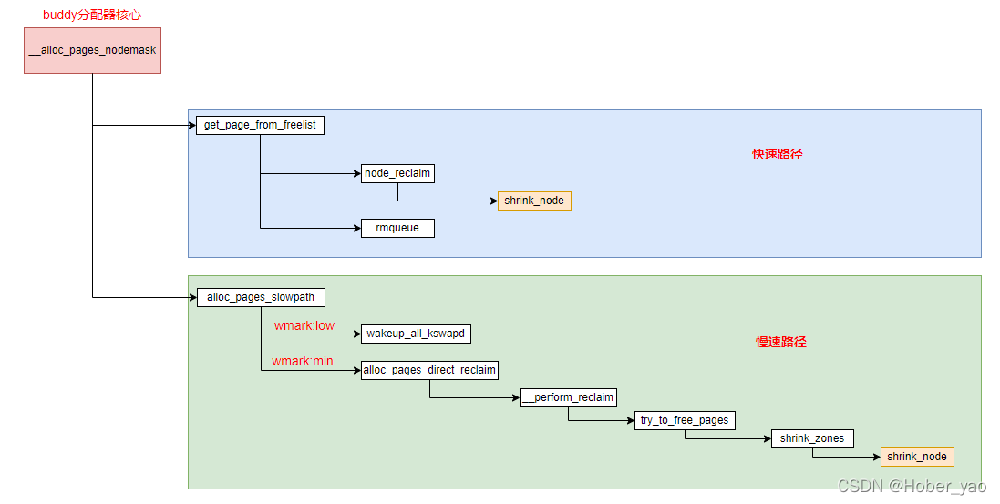

# 内存管理

## Intel页表

```
-
```

## 未解压时的页表

建立页表的代码在arch/x86/boot/compressed/head_64.S:startup_32中，并开启了分页

```
  pgtable                         
  +------------------+            pgtable + 0x1000                
0 | pgtable + 0x1000 |----------->+------------------+            pgtable + 0x2000     
  +------------------+            | pgtable + 0x2000 |----------->+------------------+ 
1 |                  |            +------------------+            | 0x000000         | 2M / page
  +------------------+            | pgtable + 0x3000 |--------+   +------------------+
2 |                  |            +------------------+        |   | 0x200000         |
  +------------------+            | pgtable + 0x4000 |-----+  |   +------------------+
3 |                  |            +------------------+     |  |   | 0x400000         |
  +------------------+            | pgtable + 0x5000 |--+  |  |   +------------------+
  |                  |            +------------------+  |  |  |   | ... ...          |
  |                  |            |                  |  |  |  |   +------------------+
  |                  |            |                  |  |  |  |   |                  |
  |                  |            |                  |  |  |  |   |                  |
  +------------------+            |                  |  |  |  |   |                  |
                                  +------------------+  |  |  |   |                  |
                                                        |  |  |   +------------------+
                                                        |  |  |                        
                                                        |  |  |                        
                                                        |  |  |   pgtable + 0x3000
                                                        |  |  +-->+------------------+
                                                        |  |      |                  |
                                                        |  |      |                  |
                                                        |  |      |                  |
                                                        |  |      +------------------+
                                                        |  |       
                                                        |  |       
                                                        |  |      pgtable + 0x4000
                                                        |  +----->+------------------+
                                                        |         |                  |
                                                        |         |                  |
                                                        |         |                  |
                                                        |         +------------------+
                                                        |                            
                                                        |                            
                                                        |         pgtable + 0x5000
                                                        +-------->+------------------+
                                                                  |                  |
                                                                  |                  |
                                                                  |                  |
                                                                  +------------------+
```

## setup阶段的页表

该部分代码在arch/x86/kernel/head_64.S；部分是在该汇编文件中硬编码(即和指令混在一起，直接存在于二进制中)，部分是在__startup_64函数中操作；

其中，early_dynamic_pgts是一个恒等映射（物理地址和虚拟地址相等），仅用作加载early_top_pgtable动作完成到jmp到高地址之前的短暂过渡，其实只有几个指令而已；进入到start_kernel之前，该部分页表会被清空；

```
                                         early_dynamic_pgts[0]                     early_dynamic_pgts[1]
                                  +----->+-----------------------+       +-------->+-------------------+       
                                  |      | early_dynamic_pgts[1] |-------+         |                   |     
                                  |      +-----------------------+       |         |                   |     
                                  |      | early_dynamic_pgts[1] |-------+         +-------------------+       
    early_top_pgt                 |      +-----------------------+                 | 16MB              |  _text here
    +-----------------------+     |      |                       |                 +-------------------+
  0 | early_dynamic_pgts[0] |-----+      |                       |                 | 16MB + 2MB        |        
    +-----------------------+     |      |                       |                 +-------------------+
  1 | early_dynamic_pgts[0] |-----+      +-----------------------+                 |                   |     
    +-----------------------+                                                      ~                   ~
    |                       |                                                      |                   |
    |                       |                                                      +-------------------+
    |                       |                                                      | 30MB              |  _end here
    |                       |                                                      +-------------------+
    |                       |                                                      |                   |
    |                       |                                                      |                   |
    |                       |                                                      +-------------------+
    |                       |            
    |                       |            
    +-----------------------+            level3_kernel_pgt                         level2_kernel_pgt
511 | level3_kernel_pgt     |----------->+-----------------------+         +------>+-------------------+  --+--
    +-----------------------+            |                       |         |       | 0x000000          |    |
                                         |                       |         |       +-------------------+    |
                                         |                       |         |       | 0x200000          |    |
                                         |                       |         |       +-------------------+    |
                                         |                       |         |       | 0x400000          |
                                         |                       |         |       +-------------------+  512MB total, 2MB per page
                                         |                       |         |       |                   |
                                         |                       |         |       |                   |    |
                                         |                       |         |       +-------------------+    |
                                         |                       |         |   255 | 0x1fe00000        |    |
                                         |                       |         |       +-------------------+  --+--
                                         |                       |         |       |                   |
                                         |                       |         |       |                   |
                                         +-----------------------+         |       +-------------------+
                                     510 | level2_kernel_pgt     |---------+       |                   |
                                         +-----------------------+                 +-------------------+
                                     511 | level2_fixmap_pgt     |---------+       |                   |
                                         +-----------------------+         |       +-------------------+
                                                                           |
                                                                           |
                                                                           |       level2_fixmap_pgt           level1_fixmap_pgt
                                                                           +------>+-------------------+   +-->+--------------------+
                                                                                   |                   |   |   |                    |
                                                                                   |    not filled     |   |   |                    |
                                                                                   |                   |   |   |                    |
                                                                                   +-------------------+   |   |   not filled       |
                                                                               506 | level1_fixmap_pgt |---+   |                    |
                                                                                   +-------------------+       |                    |
                                                                                   |    not filled     |       |                    |
                                                                                   +-------------------+       +--------------------+
```

## 直接映射的建立

kernel image映射的复制：

```c
x86_64_start_kernel
  reset_early_page_table
    memset(early_top_pgt, 0, sizeof(pgd_t) * (PTRS_PER_PGD - 1))      // 这里留下了第511项
    next_early_pgt = 0
    write_cr3(__sme_pa_nodebug(early_top_pgt))                        // 这里对cr3的写应该是为了flush tlb和page entry cache
  init_top_pgt[511] = early_top_pgt[511]                              // 复制第511项的指针
```

代码在setup_arch中的init_mem_mapping，用于从虚拟地址空间的PAGE_OFFSET处直接映射所有的物理内存

```c
-
```

## page结构体的建立

```c
setup_arch
  e820__memblock_setup                                     // 将e820表中的所有内存区域全部初始化到memblock系统中
  init_mem_mapping                                         // 建立direct mapping
  initmem_init                                             // 配置memblock的numa信息
  x86_init.paging.pagetable_init / paging_init
    sparse_memory_present_with_active_regions
    sparse_init                                            // 创建vmemmap映射
    zone_sizes_init
```

## buddy system中内存页的来源

```c
-
```

## 页表头文件梳理

```c
asm/pgalloc.h -> asm-generic/pgalloc.h
```

## fork相关的内存过程

## 内存分配与回收



## 缺页处理

v6.6，x86_64：

```c
handle_page_fault
  do_user_addr_fault
    handle_mm_fault                            // On entry, we hold either the VMA lock or the mmap_lock (FAULT_FLAG_VMA_LOCK tells you which).
      __handle_mm_fault
        handle_pte_fault
          do_pte_missing
```

## 参考文献

[内存初始化](https://zhuanlan.zhihu.com/p/613004422)

[内存模型](http://www.wowotech.net/memory_management/memory_model.html)

[Page Flags](https://zhuanlan.zhihu.com/p/590669353)

http://linux.laoqinren.net/kernel/shrink_lruvec/
