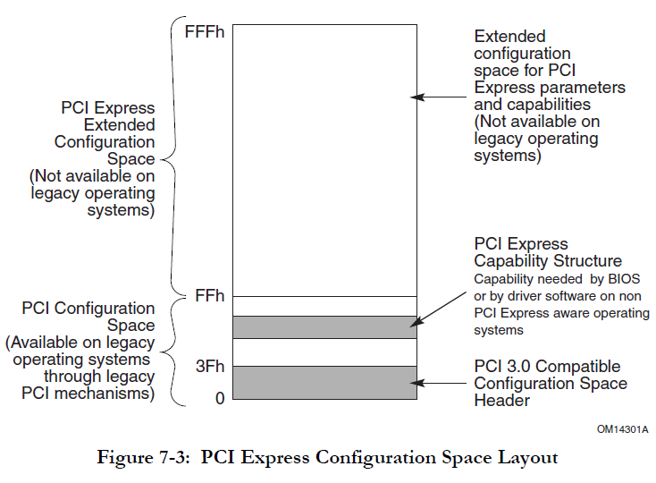
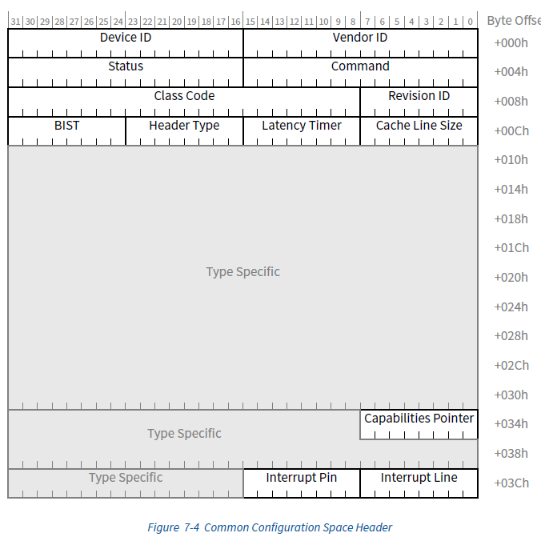

# PCI/PCIE

PCI/PCIe设备有三个空间：

- 内存地址空间

- IO地址空间

- 配置空间

## 配置空间

### 整体配置空间



### 配置空间头

配置空间头占据整体配置空间的前64字节：



### Capability机制

```
31                 16 15       8  7       0
+---------------------+----------+----------+
|         xxxx        |  Pointer |    ID    |
+----------+----------+----------+----------+
|                   xxxxx.                  |
+----------+--------------------------------+
```

- ID：由相关SIG分配

- Pointer：下一个Capability在整体配置空间中的偏移，PCI是256B，PCIe是4KB
  
  - 第一个Capability结构的地址在配置空间头的Capability字段中记录

# 数据结构


# 总线驱动模型


# 总线枚举与初始化

关键调用顺序

```c
|-->pcibus_class_init
|-->pci_driver_init
|-->acpi_pci_init
|-->acpi_init        // 这里面会进行pci总线的枚举
```

`start_kernel()`中直接调用的pci/pcie初始化相关代码：

```c
start_kernel
  setup_arch
    acpi_boot_table_init
    early_acpi_boot_init
      early_acpi_process_madt                       // 处理MDAT表
    acpi_boot_init
      acpi_table_parse                                // ACPI_SIG_BOOT、ACPI_SIG_FADT
      acpi_process_madt                               // 解析MDAT表，获取bios提供的中断信息
      x86_init.pci.init = pci_acpi_init               // 在pci_subsys_init()中调用，在acpi_boot_init()中         
  rest_init
    kernel_thread(kernel_init)

kernel_init
  kernel_init_freeable
    do_basic_setup
      do_initcalls                                    // 开始对initcall的调用
```

通过`initcall机制`调用的pci/pcie初始化相关代码：

```c
postcore_initcall(pcibus_class_init)                // 创建/sys/class/pci_bus目录
postcore_initcall(pci_driver_init)                  // 注册pci_bus_type和pcie_port_bus_type 

arch_initcall(acpi_pci_init)
arch_initcall(pci_arch_init)                        // 配置pci总线的各种访问方式

subsys_initcall(acpi_init)                          // 基于ACPI的pci设备枚举过程
```

## pcibus_class_init

主要作用是注册一个名为`pci_bus`的`class`结构，对应`/sys/class/pci_bus/`目录。

```c
static struct class pcibus_class = {
    .name           = "pci_bus",
    .dev_release    = &release_pcibus_dev,
    .dev_groups     = pcibus_groups,
};

pcibus_class_init(void)
  class_register(&pcibus_class);

postcore_initcall(pcibus_class_init);
```

## pci_driver_init

注册`pci/pcie`两类总线。该函数执行结束后，会产生`/sys/bus/pci/`和`/sys/bus/pci_express`两个目录，之后当使用`device_register()`函数注册一个新的pci设备时，将在`/sys/bus/{pci,pci_express}/drivers/`目录下创建这个设备使用的目录。

`pci_bus_match()`和`pcie_port_bus_match()`用来检查设备与驱动是否匹配，一旦匹配则调用pci_device_probe函数。

```c
struct bus_type pci_bus_type = {
    .name           = "pci",
    .match          = pci_bus_match,
    .uevent         = pci_uevent,
    .probe          = pci_device_probe,
    .remove         = pci_device_remove,
    .shutdown       = pci_device_shutdown,
    .dev_groups     = pci_dev_groups,
    .bus_groups     = pci_bus_groups,
    .drv_groups     = pci_drv_groups,
    .pm             = PCI_PM_OPS_PTR,
    .num_vf         = pci_bus_num_vf,
    .dma_configure  = pci_dma_configure,
};

struct bus_type pcie_port_bus_type = {
    .name           = "pci_express",
    .match          = pcie_port_bus_match,
};

pci_driver_init
  bus_register(&pci_bus_type);
  bus_register(&pcie_port_bus_type);

postcore_initcall(pci_driver_init);
```

## acpi_pci_init

主要作用就是注册了`acpi_pci_bus`这条总线，但目前并不知道其作用是什么。

```c
acpi_pci_init
  register_acpi_bus_type(&acpi_pci_bus)
  acpi_pci_slot_init
  acpiphp_init
```

## pci_arch_init

主要作用是配置pci总线的各种访问函数

```c
pci_arch_init
  pci_direct_probe                                        // 由linux自行枚举总线
    request_region(0xcf8, 8)                              // 分配0xcf8、0xcfc端口
    raw_pci_ops = &pci_direct_conf1
  pci_mmcfg_early_init
  x86_default_pci_init / pci_acpi_init
  pci_direct_init
```

## acpi_init

基于`ACPI`机制的`PCI/PCIe`总线枚举过程：

```c
acpi_init
  acpi_bus_init                                                            // 注册acpi_bus_type
  kobject_create_and_add("acpi", firmware_kobj)
  pci_mmcfg_late_init                                                      // 扫描MCFG表，其中包括了ecam相关的资源
  acpi_scan_init
    acpi_pci_root_init
      acpi_scan_add_handler_with_hotplug(&pci_root_handler, "pci_root")    // 注册对pci/pcie host bridge的handler，ACPI枚举过程中，发现device后会调用对应的attach()方法
    ... ...
    acpi_bus_scan
      acpi_bus_attach
    ... ...
```

`pci/pcie`总线的枚举过程聚集在了`pci_root_handler`中，其定义如下：

```c
static struct acpi_scan_handler pci_root_handler = { 
        .ids = root_device_ids,                                            // PNP0A03表示一个pci/pcie host bridge，匹配后调用acpi_pci_root_add()
        .attach = acpi_pci_root_add,
        .detach = acpi_pci_root_remove,
        .hotplug = { 
                .enabled = true,
                .scan_dependent = acpi_pci_root_scan_dependent,
        },
};
```

当发现设备是一个`pci/pcie host bridge`后，会调用`acpi_pci_root_add()`进行`pci/pcie host bridge`的创建、设备/子桥的递归枚举。

```c
acpi_add_root_add
  ... ...
  获取设备的bdf
  pci_acpi_scan_root                                        // 枚举此host bridge下的设备和子桥
    acpi_pci_root_create(acpi_pci_root_ops)
      pci_create_root_bus
      pci_scan_child_bus
        pci_scan_child_bus_extend
          for dev range(0, 256) pci_scan_slot
            pci_scan_single_device
              pci_scan_device
                pci_bus_read_dev_vendor_id
                pci_alloc_dev
                pci_setup_device
              pci_device_add                                // 触发对应的driver->probe()方法，比如virtio_pci_probe()
                pci_configure_device
                device_initialize
                list_add_tail(&dev->bus_list, &bus->devices)
                pci_set_msi_domain
                device_add
                  bus_add_device
                  kobject_uevent(&dev->kobj, KOBJ_ADD)
                  bus_probe_device
                    if drivers_autoprobe
                      device_initial_probe
                        __device_attach
                          __device_attach_driver
                            driver_match_device
                            driver_probe_device
                              really_probe
                                调用bus或者driver的probe
                    list_for_each_entry(sif, &bus->p->interfaces, node)
                      sif->add_dev(dev, sif)
          for each pci bridge pci_scan_bridge_extend
```

## pci_iommu_init

该函数主要用来初始化处理器系统的`IOMMU`，可以配置IBM X-Series刀片服务器使用的Calgary IOMMU、Intel的Vt-d和AMD的IOMMU使用的页表。
如果在Linux系统中没有使能IOMMU选项，`pci_iommu_init`函数将调用`no_iommu_init`函数，并将`dma_ops`函数设置为`nommu_dma_ops`。

## pcibios_assign_resources

## pci_init

主要作用是对已完成枚举的PCI设备进行修复工作，用于修补一些BIOS中对pci设备有影响的bug。

## pci_proc_init

主要功能是在`proc文件系统`中建立`./bus/pci/`目录，并将`proc_fs`默认提供的`file_operations`更换为`proc_bus_pci_dev_operations`。

## pcie_portdrv_init

## pci_hotplug_init

## pci_sysfs_init

# 总线及设备的实例化

## pci_host_probe


- 设备的扫描从pci_scan_root_bus_bridge开始，首先需要先向系统注册一个host bridge，在注册的过程中需要创建一个root bus，也就是bus 0，在pci_register_host_bridge函数中，主要是一系列的初始化和注册工作，此外还为总线分配资源，包括地址空间等；

- pci_scan_child_bus开始，从bus 0向下扫描并添加设备，这个过程由pci_scan_child_bus_extend来完成；

- 从pci_scan_child_bus_extend的流程可以看出，主要有两大块：

- PCI设备扫描，从循环也能看出来，每条总线支持32个设备，每个设备支持8个功能，扫描完设备后将设备注册进系统，pci_scan_device的过程中会去读取PCI设备的配置空间，获取到BAR的相关信息，细节不表了；

- PCI桥设备扫描，PCI桥是用于连接上一级PCI总线和下一级PCI总线的，当发现有下一级总线时，创建子结构，并再次调用pci_scan_child_bus_extend的函数来扫描下一级的总线，从这个过程看，就是一个递归过程。

- 从设备的扫描过程看，这是一个典型的DFS（Depth First Search）过程，熟悉数据结构与算法的同学应该清楚，这就类似典型的走迷宫的过程；

# pci驱动与设备的匹配

  匹配由两种行为触发：

- 新device添加

- 新driver注册

## 新device添加

  新设备添加到系统上之后，**猜测**应该由固件通过`ACPI`告知操作系统，具体告知方式可能为`SMI中断`或者`SCI中断`。最终应该调用到`pci_device_add()`函数：

```c
pci_device_add(pci_dev dev, xxx)      // 本函数在调用前dev中的bus字段已经设置
device_add                            // core函数
  bus_add_device
    klist_add_tail                    // 将device加入bus的device list
  bus_probe_device
    device_initial_probe              // 如果设置了自动探测
      device_attach
        __device_attach_driver
          driver_match_device
            device_driver->bus->match // pci_bus_match()
          driver_probe_device         // 如果上一步匹配上了 <------- 最终驱动
```

## 新driver注册

```c
pci_register_driver
__pci_register_driver
  drv->driver.bus = &pci_bus_type        // 表明driver所属总线
  driver_register                        // core函数
    bus_add_driver
      klist_add_tail                     // 将driver加入bus的driver list
      driver_attach                      // 如果设置了自动探测，则进行操作
        __driver_attach
          driver_match_device
            device_driver->bus->match    // pci_bus_match()
          device_driver_attach           // 如果上一步匹配上了
            driver_probe_device          // <------------------------- 最终驱动
```

## driver_probe_device

  最终会先尝试调用bus的probe函数，其中会回调到驱动的probe函数；如果bus的probe函数未定义，则直接调用driver的probe函数。  

- pci总线定义了probe函数：`pci_device_probe()`。其中做一些动作后会调用driver的probe函数。

- pcie总线未定义probe函数，直接调用driver的probe函数。

## pci_bus_match

```c
pci_bus_match
to_pci_dev                // 获取要匹配的设备
to_pci_driver             // 获取要匹配的驱动
pci_match_device
  pci_match_one_device    // 根据vendor id, device id等进行匹配
```

- 设备或者驱动注册后，触发pci_bus_match函数的调用，实际会去比对vendor和device等信息，这个都是厂家固化的，在驱动中设置成PCI_ANY_ID就能支持所有设备；

- 一旦匹配成功后，就会去触发pci_device_probe的执行。

## pci_device_probe

