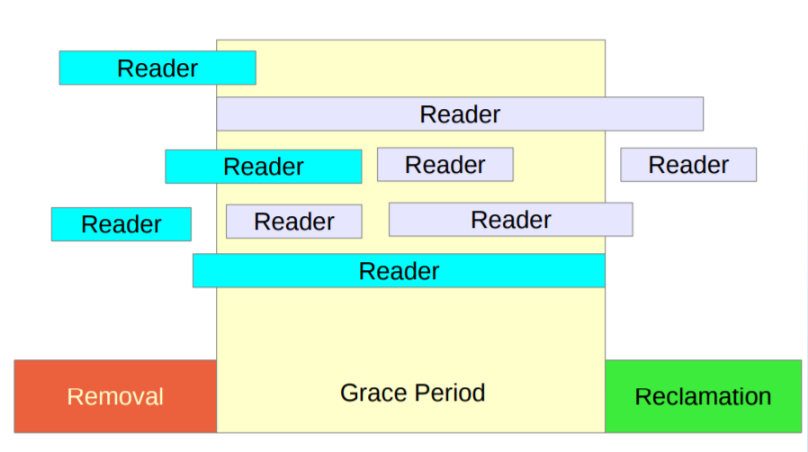
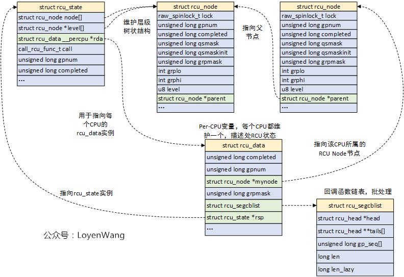
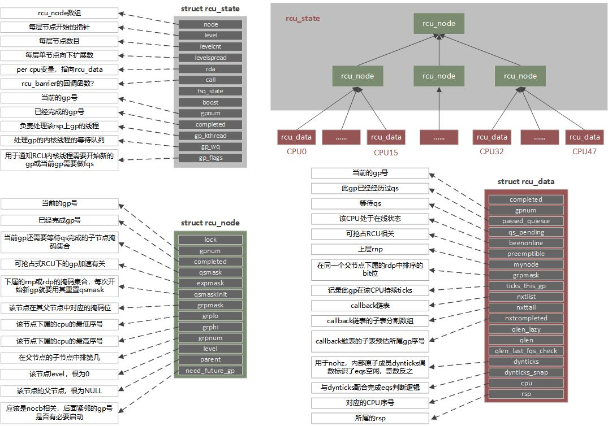
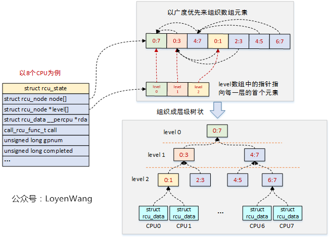

# RCU

## 模型



- **Removal**：在写端临界区部分，读取（Read()），进行复制（Copy），并执行更改（Update）操作；

- **Grace Period**：这是一个等待期，以确保所有与执行删除的数据相关的reader访问完毕；

- **Reclamation**：回收旧数据；

## 概念

- **静止状态QS(Quiescent State):** CPU发生了上下文切换称为经历一个quiescent state；

- **宽限期GP(Grace Period):** grace period就是所有CPU都经历一次quiescent state所需要的等待的时间，也即系统中所有的读者完成对共享临界区的访问；

- **读侧临界部分RCS(Read-Side Critical Section):** 保护禁止其他CPU修改的代码区域，但允许多个CPU同时读；

## 工程实现的障碍

- 中断调度，NMI中断、CPU热插拔

- 模块卸载

- 内核抢占、RT

- 节能

- 性能和多核拓展

- 稳定性

- CPU架构

- ... ...

## 接口

- 可抢占RCU：`rcu_read_lock/rcu_read_unlock`来界定区域，在读端临界区可以被其他进程抢占；

- 不可抢占RCU`(RCU-sched)`：`rcu_read_lock_sched/rcu_read_unlock_sched`来界定区域，在读端临界区不允许其他进程抢占；

- 关下半部RCU`(RCU-bh)`：`rcu_read_lock_bh/rcu_read_unlock_bh`来界定区域，在读端临界区禁止软中断；

## 关键一：如何识别宽限期？

- 在时钟tick中检测CPU处于`用户模式`或者`idle模式`，则表明CPU离开了临界区；
- 在不支持抢占的RCU实现中，检测到CPU有context切换，就能表明CPU离开了临界区；

## 数据结构

树形RCU的拓扑结构：



字段含义：



call_rcu()回调函数的组织：



## call_rcu实现

```c
__call_rcu
  local_irq_save
  rcu_segcblist_enqueue                        // 将rcu_head加入rcu_data.rcu_segcblist
  __call_rcu_core
    invoke_rcu_core
  local_irq_restore
```

## RCU宽限期处理内核线程

处理内核线程的创建：

```c
rcu_spawn_gp_kthread
  kthread_create(rcu_gp_kthread)

rcu_gp_kthread
  rcu_bind_gp_kthread
  rcu_state.gp_state = RCU_GP_WAIT_GPS
  swait_event_idle_execlusive(RCU_GP_FLAG_INIT)
  rcu_state.gp_state = RCU_GP_DONE_GPS
  rcu_gp_init
    WRITE_ONCE(rcu_state.gp_flags, 0)            // Clear all flags: New GP
    __note_gp_changes
  rcu_gp_fqs_loop
  rcu_state.gp_state = RCU_GP_CLEANUP
  rcu_gp_cleanup
  rcu_state.gp_state = RCU_GP_CLEANED
```

## 时钟中断对RCU静止状态的检测

```c
update_process_times
  rcu_sched_clock_irq
    rcu_pending
      check_cpu_stall
    invoke_rcu_core
      raise_softirq(RCU_SOFTIRQ)

RCU_SOFTIRQ / rcu_core_si
  rcu_core
    rcu_check_quiescent_state
      note_gp_changes
        local_irq_save
        __note_gp_changes
          rcu_advance_cbs                            // 如果rcu_data->gp_seq < leaf rcu_node->gp_seq
          rcu_accelerate_cbs                         // 否则 ～
            rcu_start_this_gp                        // 这回促使rcu_gp_thread
        raw_spin_unlock_irqrestore_rcu_node
      rcu_report_qs_rdp
    rcu_check_gp_start_stall
    rcu_do_batch
```

## 进程调度对RCU宽限期的操作

```c
schedule
  __schedule
    rcu_note_context_switch
```

## 参考文献

[linux rcu浅析_rcu linux-CSDN博客](https://blog.csdn.net/kaka__55/article/details/136031632?spm=1001.2014.3001.5502)

[深入理解RCU|核心原理-CSDN博客](https://blog.csdn.net/lianhunqianr1/article/details/118215624)

[【原创】Linux RCU原理剖析（一）-初窥门径 - LoyenWang - 博客园](https://www.cnblogs.com/LoyenWang/p/12681494.html)

[【原创】Linux RCU原理剖析（二）-渐入佳境 - LoyenWang - 博客园](https://www.cnblogs.com/LoyenWang/p/12770878.html)
