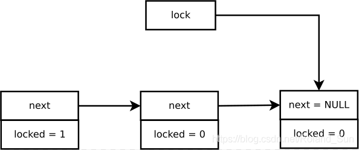
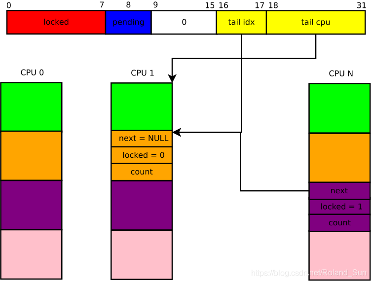

# spin_lock分析

## 初代自旋锁

v2.6.24之前，spinlock就是一个原子整数，初始化为1。加锁时，做atomic_dec()，如果其值为0，则表示获取到锁，如果为负数则需要忙等。

初代自旋锁的缺陷：公平性无法保障，即无法确保等待时间最长的竞争者优先获取到锁。

## ticket spinlock

实现类似叫号系统，每个锁的竞争者领取一个号码，持有者释放锁的时候递增号码。

ticket spinlock的缺陷：缓存行颠簸，即持有者释放锁的时候要invalid掉所有其他cpu上对应的缓存行。

## MCS spinlock

两个优点：

- 保证自旋锁申请者以先进先出的顺序获取锁（FIFO）

- 只在本地可访问的标志变量上自旋

结构体：

```c
struct mcs_spinlock {
    struct mcs_spinlock *next;
    int locked; /* 1 if lock acquired */
    int count;  /* nesting count, see qspinlock.c */
};
```

思路：



- 主锁的next指向最后一个争抢者

- 每个锁的争抢者生成一个本地的mcs_spinlock，拿不到锁时将自己挂入前面一个等待的next，并将主锁的next指向自己。然后在自己本地的mcs_spinlock->locked上自旋

- 每个锁的释放者负责将自己的next的locked改为1

没见过mcs单独是怎么用的，只能做几点猜测：

- 主锁本身也是mcs_spinlock结构体

- 主锁的locked字段应该没啥用，其next是否为空才有用

缺点：

- 结构体太大了

## qspinlock

思路还是mcs spinlock，只不过适应了当前的数据结构：



### 三元组

```c
/*
 * Bitfields in the atomic value:
 *
 * When NR_CPUS < 16K
 *  0- 7: locked byte
 *     8: pending
 *  9-15: not used
 * 16-17: tail index
 * 18-31: tail cpu (+1)
 *
 * When NR_CPUS >= 16K
 *  0- 7: locked byte
 *     8: pending
 *  9-10: tail index
 * 11-31: tail cpu (+1)
 */
```

抽象一个三元组（tail，pending，locked）。

### tail idx的作用

每个cpu上有1个qnode数组，数组中有4个元素。因为spinlock可以在不同的上下文中被调用，所以需要准备多个qnode，tail_idx就是编码了本cpu此次排队使用的第几个qnode。

应注意的是，并没有严格指定idx和上下文类型的一一对应关系。因为上下文是后入先出的，不会乱序，所以每次对idx+1即可，可以跳着来。

## pvspinlock

spinlock的实现依赖这样一个假设：锁的持有线程和等待线程都不能被抢占。但是在虚拟化场景下，vCPU可能在任意时刻被hypervisor调度，导致其他vCPU上的锁等待线程忙等浪费CPU。这会导致已知的Lock Holder Preemption（LHP）和 Lock Waiter Preemption（LWP）问题。

- LHP：虚拟机中的锁持有线程被抢占，导致锁等待线程忙等，直到锁持有者线程再次被调度并释放锁后，锁等待线程才能获取到锁。从锁持有线程被抢占到其再次被调度运行这段时间，其余锁等待线程的忙等其实是在浪费CPU算力。

- LWP：虚拟机中的下一个锁等待线程被抢占，直到其下一次再次被调度并获取锁后，其余锁等待线程的忙等其实锁在浪费CPU算力。

### 核心逻辑

```c

```


