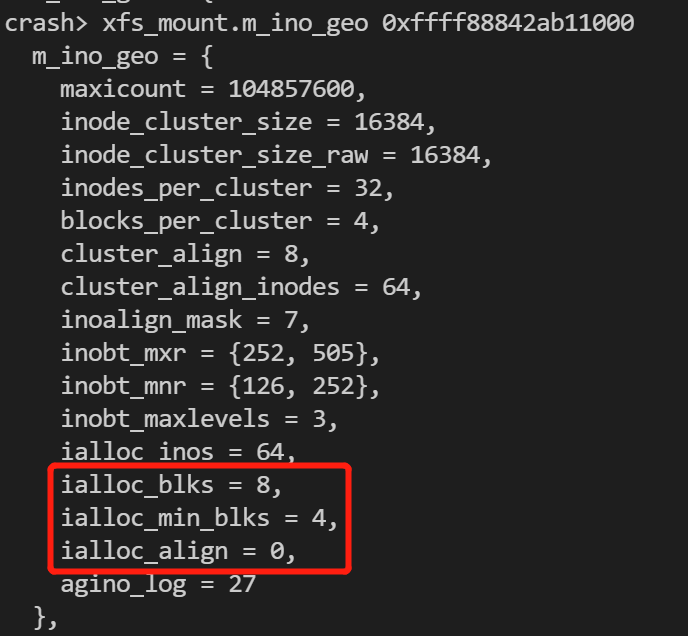
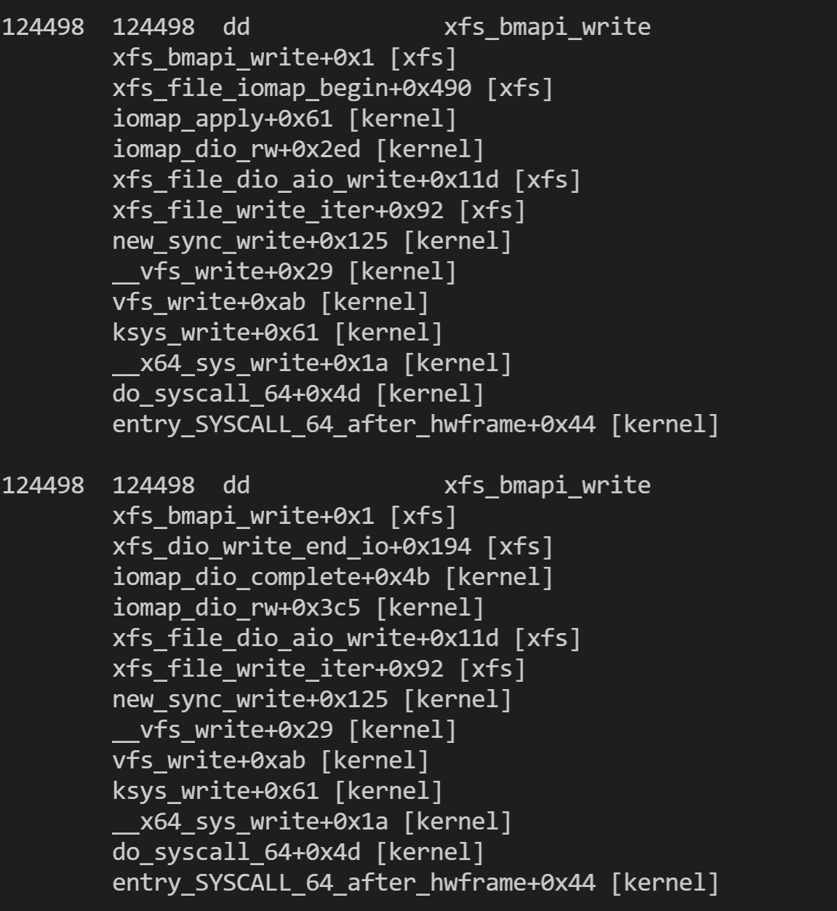
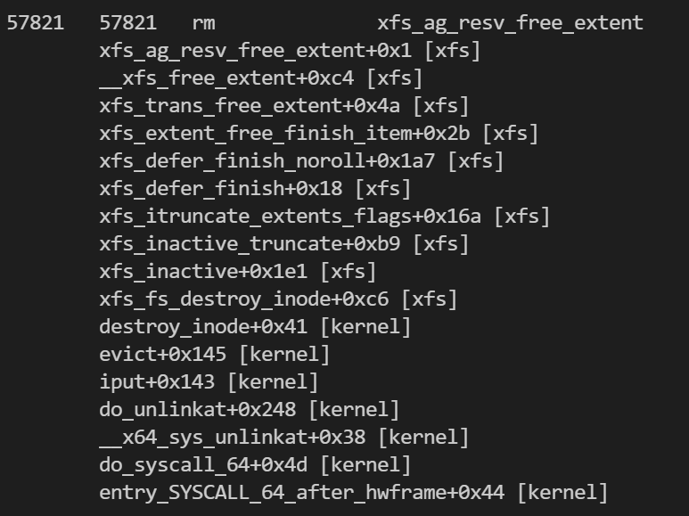

# xfs

## 日志外存布局

- journal: 由一系列log records组成。
- log record：对应一个in-core log buffer，最大256KiB。每个log record有一个log sequence number。每个log record包含一个完整的transaction或部分transaction。
- transaction：由一系列log operation headers以及对应的log items组成。事务中的第一个op建立事务号，最后一个op是一个commit record。

### log record

一个log record在磁盘上以xlog_rec_header开始。

### log operations

一个log operations由一个xlog_op_header头，以及对应的数据区域组成。

### log item

log item是一个xlog_op_header后紧跟的数据区域。每一个log item必须以xfs_log_item作为头。

```
<oph><trans-hdr><start-oph><reg1-oph><reg1><reg2-oph>...<commit-oph>
```

## 数据结构

### 超级块

#### 外存数据结构

xfs_sb_t - superblock - 1 sector

#### 内存数据结构

xfs_sb_t - xfs_mount.m_sb

超级块在内存和外存上都是一致的数据结构；

### 空闲磁盘块

#### 外存数据结构

xfs_agf_t - AG free block info - 1 sector

xfs使用两棵树来跟踪空闲空间：

- 以block number为键值
- 以size为键值

xfs_agf_t中的block numbers/indexes/counts都是AG relative的。

#### 内存数据结构

### 索引节点表

#### 外存数据结构

xfs_agi_t - AG inode B+tree info - 1 sector

#### 索引节点分配中的对齐

各种alignment、length值的含义：

| 值                                | 含义  |
| -------------------------------- | --- |
| xfs_ino_geometry.ialloc_blks     |     |
| xfs_ino_geometry.ialloc_min_blks |     |
| xfs_ino_geometry.cluster_align   |     |
| xfs_sb.sb_spino_align            |     |
| xfs_sb.sb_inoalignmt             |     |

### 内部空闲链表

#### 外存数据结构

xfs_agfl_t - AG internal free list - 1 sector

### Log item

#### 外存数据结构

#### 内存数据结构

xfs_log_item

## 虚拟文件系统数据结构

|      | file_operations         | inode_operations         |
| ---- | ----------------------- | ------------------------ |
| file | xfs_file_operations     | xfs_inode_operations     |
| dir  | xfs_dir_file_operations | xfs_dir_inode_operations |

## read_iter

### dio

### buffer_io

```c

```

## write_iter

### dio

```c
xfs_file_write_iter
  xfs_file_dio_aio_write
    xfs_ilock
    iomap_dio_rw
      build iomap_dio                               // iomap_dio描述一个direct io的整体信息
      filemap_write_and_wait_range                  // 将direct io覆盖范围内的page cache先全部写到磁盘上去
      blk_start_plug
      iomap_apply(xfs_iomap_ops, iomap_dio_actor)   // 各种iomap的回调函数
        xfs_iomap_ops->iomap_begin(&iomap)          // 查文件偏移与磁盘偏移的映射；对扩大写保留磁盘空间；对应xfs_file_iomap_begin()
          xfs_bmapi_read
          xfs_reflink_allocate_cow                  // -- 对于cow inode，分配cow fork中的空间
            xfs_bmapi_write(XFS_BMAPI_COWFORK)
          xfs_iomap_write_direct
            bmapi_flags = XFS_BMAPI_PREALLOC        // --------
            xfs_trans_alloc
            xfs_trans_ijoin
            xfs_bmapi_write
              xfs_bmapi_allocate
                xfs_bmap_alloc
                  xfs_bmap_rtalloc                  // 对于realtime设备
                  xfs_bmap_btalloc                  // 对于btree
                    xfs_alloc_vextent
                xfs_bmap_add_extent_delay_real
                xfs_bmap_add_extent_hole_real
              xfs_bmapi_convert_unwritten           // -------- dio中会有两次进入本函数，这里是第1次
                return 0                            // -------- 在这个位置进入时，带有XFS_BMAPI_PREALLOC，直接返回
              xfs_bmapi_update_map
              xfs_bmap_btree_to_extents
            xfs_trans_commit
        iomap_dio_actor(&iomap)                     // 创建bio；通过submit_bio()提交数据到块层
        xfs_iomap_ops->iomap_end(&iomap)            // 对缩小写进行磁盘空间清理
      blk_finish_plug
      iomap_dio_complete
        xfs_dio_write_end_io
          xfs_reflink_end_cow                       // xfs原子写的收尾
          ... xfs_bmapi_convert_unwritten           // -------- dio中会有两次进入本函数，这里是第2次
            xfs_bmap_add_extent_unwritten_real      // -------- 在这个位置进入时，带有XFS_BMAPI_CONVERT，执行unwritten -> written的转换
    xfs_iunlock
```

### buffer io

#### 写入pagecache：

```c
xfs_file_write_iter
  xfs_file_buffered_aio_write
    xfs_ilock(iolock)                               // vfs inode->i_rwsem
    xfs_file_aio_write_checks
    iomap_file_buffered_write(xfs_iomap_ops)
      iomap_apply(iomap_write_actor)
    xfs_iunlock(iolock)                             // vfs inode->i_rwsem
```

#### pagecache回写触发

- 主动触发
  
  - `echo 3 > /proc/sys/vm/drop_caches`

- 周期回写
  
  - `vm.dirty_writeback_centisecs`
  
  - `vm.dirty_expire_centisecs`
  
  - `vm.dirty_background_ratio`

- sync系统调用
  
  - `sync()`
  
  - `fsync()`
  
  - `fdatasync()`

- 内存回收

- O_SYNC

- O_DIRECT

#### pagecache回写流程

```c
xfs_vm_writepages
  xfs_iflags_clear(XFS_ITRUNCATED)
  iomap_writepages(xfs_writeback_ops)
    writeback_control->ops = xfs_writeback_ops
    write_cache_pages(iomap_do_writepage)
    iomap_submit_ioend
```

## write_inode_now

```c

```

## 事务

事务整体流程：

```c
xfs_trans_alloc                 // 分配一个事务，并做资源预留
xfs_trans_ijoin                 // 关联inode节点到xfs_trans，此处是以xfs_fs_dirty_inode()为例
  xfs_trans_add_item
xfs_trans_log_xxx
xfs_trans_commit                // 事务提交
```

### xfs_tran_alloc()

```c
xfs_trans_alloc
  tp = kmem_zone_zalloc                                       // 分配xfs_trans结构体，内部清零
  初始化tp
  xfs_trans_reserve                                           // 预留事务所需空间
    current_set_flags_nested(PF_MEMALLOC_NOFS)
    xfs_mod_fdblocks
    xfs_log_reserve
      xlog_ticket_alloc
        kmem_zone_zalloc
        xfs_log_calc_unit_res                                 // 计算log要保留的字节
      xlog_grant_push_ail
      xlog_grant_head_check
      xlog_grant_add_space
      xlog_verify_grant_tail
    xfs_mod_frextents
```

## sparse inode

查看mkfs.xfs是是否开启了sparse inode特性：

```c
xfs_sb_version_hassparseinodes()
```

相关数据结构的crash结果：



## 磁盘块分配

### 分配参数

```c
struct xfs_bmalloca                            // xfs_bmapi_*使用
struct xfs_alloc_arg / xfs_alloc_arg_t         // xfs_alloc_vextent使用
```

### xfs_iomap_write_direct

针对`direct io`的磁盘块分配

```c
xfs_iomap_write_direct
  resaligned = xfs_aligned_fsb_count                                     // 处理extsize对齐
  resblks = XFS_DIOSTRAT_SPACE_RES(mp, resaligned)                       // 计算 更新元数据、写入用户数据 一共需要最多多少个磁盘块
  xfs_trans_alloc(M_RES(mp)->tr_write, resblks)
  xfs_trans_ijoin
  xfs_bmapi_write
  xfs_trans_commit
```



### xfs_bmapi_write

```c
xfs_bmapi_write
  xfs_bmalloca->conv = !!(flags & XFS_BMAPI_CONVERT)
  xfs_bmalloca->flags = flags
  xfs_bmalloca->minleft = 
  xfs_bmapi_allocate(xfs_bmalloca)
    xfs_bmalloca->minlen = XFS_BMAPI_CONTIG ? bma->length : 1            // 目标分配是否需要连续
    if (mp->m_dalign && bma->length >= mp->m_dalign)
      xfs_bmap_isaeof                                                    // 设置xfs_bmalloca->aeof
    xfs_bmapi_alloc
      xfs_bmap_btalloc
        xfs_bmap_adjacent                                                // 根据逻辑偏移前后的extents选择物理extents所处的位置，确定在哪个物理块附近分配
        args.maxlen = min(ap->length, mp->m_ag_max_usable)
        make xfs_alloc_arg_t
        xfs_bmap_btalloc_filestreams                                     // 如果是filestream inode，确定分配的最小长度
        xfs_bmap_btalloc_nullfb                                          // xfs_trans->t_firstblock == NULLFSBLOCK，确定分配的最小长度
        xfs_alloc_vextent                                                // struct xfs_bmalloca -> struct xfs_alloc_arg
```

## 磁盘块释放

### ftruncate

```c
ksys_ftruncate
  do_truncate
    inode_lock
    notify_change
      inode->i_op->setattr / xfs_vn_setattr
        xfs_ilock(XFS_MMAPLOCK_EXCL)
        xfs_vn_setattr_size
          xfs_setattr_size
            iomap_zero_range
            filemap_write_and_wait_range
              __filemap_fdatawrite_range
                make writeback_control
                wbc_attach_fdatawrite_inode
                do_writepages                                            // 核心flush函数
                  while true:
                    mapping->a_ops->writepages / xfs_vm_writepages
                      write_cache_pages
                        xfs_do_writepage
                          offset = i_size_read(inode)                    // 这里获取的是vfs inode size
                          xfs_writepage_map
                            xfs_map_blocks                               // 这里进入时，其实只是拿着一个page的offset进去
                              xfs_convert_blocks
                                xfs_bmapi_convert_delalloc               // 开始使用xfs_writepage_ctx作为参数
                                  xfs_bmapi_allocate
                     if ((not -ENOMEM) || (not WB_SYNC_ALL))             // 非kworker、非WB_SYNC_ALL会退出
                       break
                wbc_detach_inode
              filemap_fdatawait_range
            iomap_truncate_page

        xfs_iunlock(XFS_MMAPLOCK_EXCL)
    inode_unlock
```

### xfs_bunmapi

```c
xfs_bunmapi
  __xfs_bunmapi
    xfs_bmap_del_extent_delay                            // 删除仅位于内存btree上的delay extent，不涉及xfs_trans
    xfs_bmap_del_extent_real                             // 删除同时位于内存和磁盘btree上的real extent，涉及xfs_trans
      remove extents from XFS_BTNUM_BMAP btree           // XFS_BTNUM_BMAP是inode的磁盘块索引btree
      __xfs_bmap_add_free                                // 通过defer ops将extents加入XFS_BTNUM_BNO/XFS_BTNUM_CNT这两棵空闲磁盘块btree
        xfs_extent_free_item.xefi_startblock = bno
        xfs_extent_free_item.xefi_blockcount = len
        xfs_defer_add(XFS_DEFER_OPS_TYPE_FREE)           // 等待xfs_trans_commit() -> xfs_defer_finish_noroll()处理
```

### xfs_defer_finish_noroll

```c
xfs_trans_commit
  __xfs_trans_commit(regrant=false)                      // 只有regrant为false时才可能进入xfs_defer_finish_noroll
    xfs_defer_finish_noroll
      while (xfs_trans->t_dfops || dop_pending)
        xfs_defer_create_intents                         // 创建intent item
        list_x_tail(&(*tp)->t_dfops, &dop_pending)       // 老版本 - 有问题，done item不能及时处理
        list_x_head(&(*tp)->t_dfops, &dop_pending)       // bugfix - 可以及时处理done item
        xfs_defer_trans_roll
        xfs_extent_free_create_done                      // 创建done item
        xfs_extent_free_finish_item                      // 真正执行free的动作，执行结束后会设置done item的XFS_LI_DIRTY标志，从而在后面被写入iclog
          xfs_trans_free_extent
            __xfs_free_extent
              xfs_free_ag_extent
              xfs_extent_busy_insert                     // 从这里开始，extents开始被标记为busy
            tp->t_flags |= XFS_TRANS_DIRTY
```

## xfs_mount->m_fdblocks增加

```c
__xfs_free_extent
  xfs_free_ag_extent
    xfs_alloc_update_counters
    xfs_ag_resv_free_extent
      xfs_trans_mod_sb(XFS_TRANS_SB_FDBLOCKS)

__xfs_trans_commit
  xfs_trans_apply_sb_deltas
```



## xfs统计

`/sys/fs/xfs/stats/stats`的数据来源：

```c
struct __xfsstats;

xfs_stats_format                   // 打印函数
```

`/sys/fs/xfs/vdc/log/*`的数据来源：

```c
static struct attribute *xfs_log_attrs[] = {
        ATTR_LIST(log_head_lsn),
        ATTR_LIST(log_tail_lsn),
        ATTR_LIST(reserve_grant_head),
        ATTR_LIST(write_grant_head),
        NULL,
};

log_head_lsn_show                    // log_head_lsn - 来源是(l_curr_cycle, l_curr_block)
log_tail_lsn_show                    // log_tail_lsn - 来源是(l_tail_lsn)
```