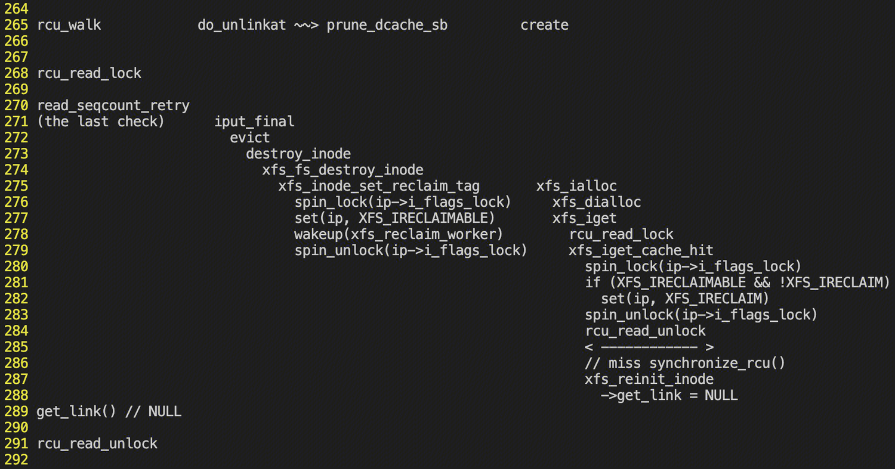

# XFS inode reuse

# bug概览



触发条件（缺一不可）：

1. rcu walk mode中遍历到一个xfs文件的inode A

2. 同时该inode A被unlink删除

3. 同时该xfs文件系统create一个新文件

由于xfs inode reuse机制的存在，2中被unlink的inode有可能在其内存被彻底free之前被create内核路径截获，并使用xfs_reinit_inode()重新初始化为3中新文件的inode。在xfs_reinit_inode()中，会将get_link函数指针置为NULL。但此时rcu walk还处于rcu临界区中，即读者和写者未互斥。

# xfs inode的删除

先来看一下vfs层inode的删除路径，最终的删除操作发生在该inode的最后一次iput()

```
iput
  iput_final
    ... ...
    inode->i_state |= I_FREEING
    ... ...
    evict(inode)
      destroy_inode
        if (sops->destroy_inode) {
          sops->destory_inode
          if (!sops->free_inode)                        // 对于xfs，其没有free_inode方法，在此处退出
            return
        }
        inode->free_inode = sops->free_inode
        call_rcu(inode->free_inode)                     // 对于ext4等，其设置了专门用于释放inode内存的方法，通过call_rcu()在rcu宽限期后执行
```

可见，对于ext4等文件系统来说，在iput()中会通过call_rcu()在本rcu宽限期结束后释放目标inode的内存。这保证了在iput()返回后，到本rcu宽限期结束前的这一段时间内不会再对该inode进行任何更改操作。

但xfs此处并没有这么做，其没有free_inode()方法，inode的生命周期完全交由其destroy_inode()方法控制，该方法为xfs_fs_destroy_inode()：

```
xfs_fs_destroy_inode
  xfs_inactive                                          // 在磁盘上删除该inode。从这里开始，该xfs_inode便可以被xfs_ialloc()重新分配了！
  xfs_inode_set_reclaim_tag(xfs_inode)
    spin_lock(&xfs_inode->i_flags_lock)
    __xfs_iflags_set(xfs_inode, XFS_IRECLAIMABLE)       // 标记该xfs_inode可以被重用了（内存中的xfs_inode)
    wakeup(xfs_reclaim_worker)                          // 唤醒负责回收工作的内核线程
    spin_unlock(&xfs_inode->i_flags_lock)
```

假设此时没有新inode的创建，那么该inode最终应该由xfs_reclaim_worker内核线程释放掉：

```
xfs_reclaim_worker
  xfs_reclaim_inodes                                    // 回收xfs_inode
    xfs_reclaim_inodes_ag
      xfs_reclaim_inode_grab
        spin_lock(&xfs_inode->i_flags_lock)
        __xfs_iflags_set(ip, XFS_IRECLAIM)             // 标记已被回收 - 要求是已经标记了XFS_IRECLAIMABLE，且未标记为XFS_IRECLAIM
        spin_unlock(&xfs_inode->i_flags_lock)
      释放上面成功标记XFS_RECLAIM的xfs_inode              // 可以认为此处对应xfs_inode生命周期的完结
  xfs_reclaim_work_queue                               // 保证本内核线程周期性运行
```

针对上面第6行的要求，其含义为：

- 标记了XFS_IRECLAIMABLE的xfs_inode是可以回收的。所以我们只能尝试回收已经标记了XFS_IRECLAIMABLE的xfs_inode

- 标记了XFS_RECLAIM的说明被xfs的inode reuse侧截获重用了（参见下一节内容）

针对上面第8行，如果xfs_reclaim_worker()未成功标记XFS_IRECLAIM，则放弃对该xfs_inode的处理。这意味着，xfs_ialloc()侧成功截获该xfs_inode的使用权。

# xfs inode的分配与reuse

xfs中inode的分配从xfs_ialloc()开始：

```
xfs_ialloc
  xfs_dialloc                                          // 从磁盘上分配一个空闲inode，并返回其对应的ino。参见上面的xfs_inactive()的注释
  xfs_iget                                             // 通过ino读取并在内存中构造xfs_inode。注意，这里有可能重新截获正在被回收的xfs_inode
    xfs_inode = radix_tree_lookup(..., ino)            // 这里返回的xfs_inode有可能正处于xfs_reclaim_worker的回收状态
    if (xfs_inode)
      xfs_iget_cache_hit                               // 在缓存中查到了，可能出问题的场景
        spin_lock(&xfs_inode->i_flags_lock)
        __xfs_iflags_set(ip, XFS_IRECLAIM)             // 标记截获 - 要求是标记了XFS_IRECLAIMABLE，且未标记为XFS_IRECLAIM
        spin_unlock(&xfs_inode->i_flags_lock)
        对于上面成功截获的xfs_inode:
          xfs_reinit_inode                             // 注意注意，这里就导致xfs_inode中各种指针被重新初始化！即错误的根源！
    else
      xfs_iget_cache_miss                              // 缓存中没有，重新分配，对我们无影响的场景
```

针对上面的第8行，其标记目的是迫使xfs_reclaim_worker无法真正释放内存（参见xfs_reclaim_worker()中的第6行）。即，该xfs_inode被成功截获。

# 解决方案

- 较为理想的解决方案为在xfs_reinit_inode()前添加synchronize_rcu()，等所有cpu退出rcu临界区后再执行reinit操作，但此方案的性能回退严重。
  
  - 上游考虑使用poll_state_synchronize_rcu()配合cond_synchronize_rcu()来减少非必要的rcu同步，但遗憾的是，该接口在v5.4中并未实现。

- 目前拟采用的方案为，在rcu walk侧读取get_link()函数指针前，检查dentry->d_seq顺序锁是否有变化（该顺序锁的写者在do_unlinkat -> vfs_unlink -> d_delete），如果有变化则说明该inode有可能被unlink了，此时应返回-ECHILD迫使rcu walk转换为ref walk。
  
  - 该方案风险分析：
    
    - 性能风险：只是一个seqlock的check
      
      - 虽然部署在vfs层，但对于非xfs文件系统，该check肯定是通过的，无显著性能损失。
      
      - 对于xfs文件系统
        
        - 如果未触发reuse，则可以安全通过检查
        
        - 如果触发了reuse，则返回-EAGAIN，回退到ref walk，避免crash
    
    - 安全风险：无crash风险
    
    - KABI：KABI兼容

# 触发窗口

rcu walk中是纯粹的内存操作，理应很快结束。而unlink侧和create侧都涉及了读盘、睡眠等耗时操作。

猜测可能的触发场景是：rcu walk被中断打断，中断上下文执行了很久，然后紧跟着在irq_exit()时进入了软中断处理，其中又处理了很久。

# 社区讨论的邮件列表

该问题的讨论由来已久，只是坎坷波折。xfs的作者并不相信还有这种问题的存在，笔者最近通过分析vmcore终于让xfs的作者承认了问题的存在，并探讨了可能的解决方案。

- https://lore.kernel.org/linux-xfs/20231205113833.1187297-1-alexjlzheng@tencent.com/
