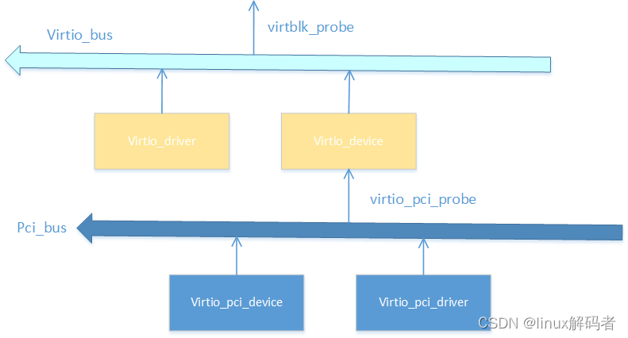
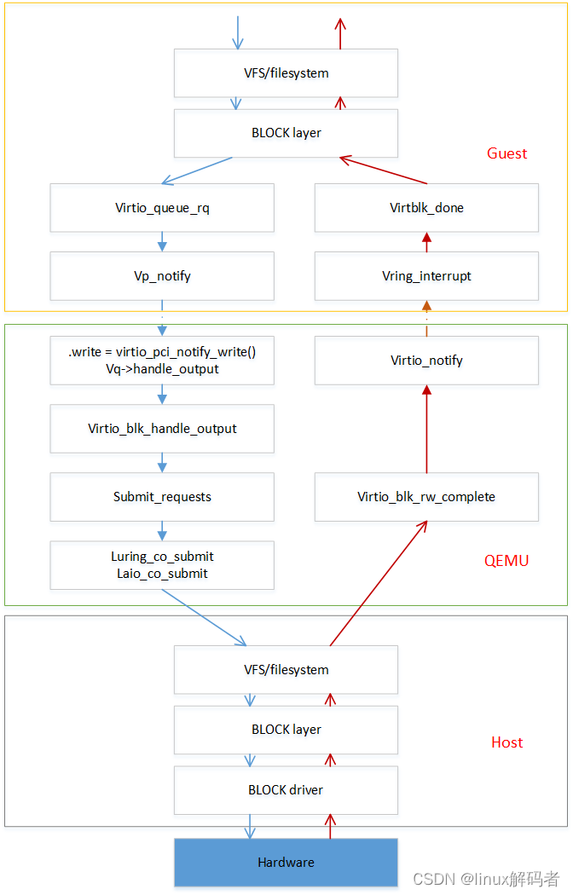
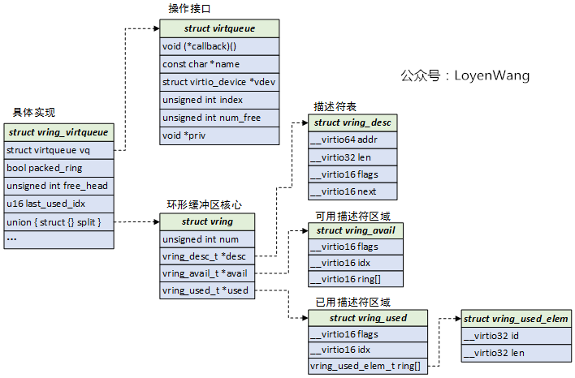

# virtio_blk设备上线

```c
static struct pci_driver virtio_pci_driver = { 
        .name           = "virtio-pci",
        .id_table       = virtio_pci_id_table,
        .probe          = virtio_pci_probe,
        .remove         = virtio_pci_remove,
#ifdef CONFIG_PM_SLEEP
        .driver.pm      = &virtio_pci_pm_ops,
#endif
        .sriov_configure = virtio_pci_sriov_configure,
};
```

`virtio_blk设备`作为一个`pci/pcie设备`挂入`pci/pcie总线`，设备与驱动匹配后触发驱动的`probe()方法`。

## virtio_pci_probe



`virtio_blk设备`中的`pci/pcie设备`在`probe()`阶段最终的作用是向`virtio_bus`注册`virtio_device`：

```c
virtio_pci_probe(pci_dev)                              // pci_device结构体
  vp_dev = alloc(s virtio_pci_device)
  pci_set_drvdata(pci_dev, vp_dev)                     // 将virtio_pci_device关联到pci_device->device->driver_data中
    pci_dev->dev->driver_data = vp_dev
  vp_dev->pci_dev = pci_dev                            // 将pci_device关联到virtio_pci_device中
  pci_enable_device(pci_dev)
  virtio_pci_modern_probe(vp_dev)                      // 映射、读取virtio pci设备在bar空间中的各种features
    pci_find_capability
      __pci_bus_find_cap_start
      __pci_find_next_cap

  register_virtio_device(&vp_dev->vdev)                // 注册struct virtio_device
```

## register_virtio_device

```c
register_virtio_device(virtio_device)
  virtio_device->device->bus_type = &virtio_bus        // 配置virtio_device对应的总线为virtio_bus
  ida_simple_get(&virtio_index_ida)                    // 分配唯一的索引
  device_add(virtio_device->device)                    // 会触发bus->match --> bus->probe
```

`virtio_bus`的定义如下：

```c
static struct bus_type virtio_bus = {
        .name  = "virtio",
        .match = virtio_dev_match,
        .dev_groups = virtio_dev_groups,
        .uevent = virtio_uevent,
        .probe = virtio_dev_probe,
        .remove = virtio_dev_remove,
};
```

其`probe()`方法为`virtio_dev_probe()`，其关键目的：

- 协商设备feature

- 调用驱动的`probe()`方法

主要流程如下：

```c
virtio_dev_probe
  device_features = dev->config->get_features(dev)
  ... ...
  drv->probe()                                        // 调用virtio_blk驱动的probe方法
```

`virtio_blk`驱动定义如下：

```c
static struct virtio_driver virtio_blk = {
        .feature_table                  = features,
        .feature_table_size             = ARRAY_SIZE(features),
        .feature_table_legacy           = features_legacy,
        .feature_table_size_legacy      = ARRAY_SIZE(features_legacy),
        .driver.name                    = KBUILD_MODNAME,
        .driver.owner                   = THIS_MODULE,
        .id_table                       = id_table,
        .probe                          = virtblk_probe,
        .remove                         = virtblk_remove,
        .config_changed                 = virtblk_config_changed,
#ifdef CONFIG_PM_SLEEP
        .freeze                         = virtblk_freeze,
        .restore                        = virtblk_restore,
#endif
};
```

其`virtblk_probe()`方法如下：

```c
virtblk_probe
  ... ...
  init_vq
    alloc vqs                                        // 分配vring，此处可以考虑numa结构
  vblk->disk = alloc_disk
  vblk->tag_set.ops = &virtio_mq_ops
  vblk->tag_set.numa_node = NUMA_NO_NODE
  vblk->tag_set.flags = BLK_MQ_F_SHOULD_MERGE
  vblk->tag_set.cmd_size =
  vblk->tag_set.driver_data = vblk
  vblk->tag_set.nr_hw_queues = vblk->num_vqs
  blk_mq_alloc_tag_set(&vblk->tag_set)
  blk_mq_init_queue(&vblk->tag_set)
  virtio_device_ready
  device_add_disk
```

# 数据流处理

数据流处理过程主要由`vblk->tag_set.ops = &virtio_mq_ops`来承接，其定义如下：

```c
static const struct blk_mq_ops virtio_mq_ops = {
        .queue_rq       = virtio_queue_rq,
        .commit_rqs     = virtio_commit_rqs,
        .complete       = virtblk_request_done,
        .init_request   = virtblk_init_request,
#ifdef CONFIG_VIRTIO_BLK_SCSI
        .initialize_rq_fn = virtblk_initialize_rq,
#endif
        .map_queues     = virtblk_map_queues,
};
```

处理流程如下：



# virtqueue

核心数据结构如下图：



# 参考文献

[VirtIO实现原理 —— PCI基础（1）_virtio pcie-CSDN博客](https://blog.csdn.net/phmatthaus/article/details/135723055)

[VIRTIO-BLK代码分析（2）VIRTIO驱动分析_mtk virtio驱动-CSDN博客](https://blog.csdn.net/flyingnosky/article/details/132723811)

[VIRTIO-BLK代码分析（3）数据流处理_virtio-blk iothread-CSDN博客](https://blog.csdn.net/flyingnosky/article/details/132724114?spm=1001.2014.3001.5502)