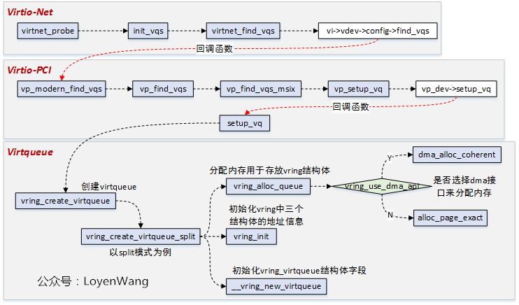

# virtio_net驱动

```c
static struct virtio_driver virtio_net_driver = {
        .feature_table = features,
        .feature_table_size = ARRAY_SIZE(features),
        .feature_table_legacy = features_legacy,
        .feature_table_size_legacy = ARRAY_SIZE(features_legacy),
        .driver.name =  KBUILD_MODNAME,
        .driver.owner = THIS_MODULE,
        .id_table =     id_table,
        .validate =     virtnet_validate,
        .probe =        virtnet_probe,
        .remove =       virtnet_remove,
        .config_changed = virtnet_config_changed,
#ifdef CONFIG_PM_SLEEP
        .freeze =       virtnet_freeze,
        .restore =      virtnet_restore,
#endif
};
```

# 初始化

virtio_pci_probe() -> register_bus_type() -> device_add() -> .probe()：



### virtio-net层

```c
virtnet_probe
  dev = alloc_etherdev_mq
  dev->netdev_ops = &virtnet_netdev
  init_vqs                                    // 初始化virtio queue
    virtnet_alloc_queues
    virtnet_find_vqs
    virtnet_set_affinity
```

### virtio-pci层

```c
vp_modern_find_vqs
  vp_find_vqs
    vp_find_vqs_msix
      vp_request_msix_vectors
        pci_alloc_irq_vectors_affinity                 // 分配irq
        request_irq                                        // 给config队列的irq设置处理函数
      vp_setup_vq
        vp_dev->setup_vq / setup_vq
          vring_create_virtqueue
          vp_iowriteXX                                 // 通过common cfg向virtio后端通知virtqueue的地址
```

# kvm侧中断配置的模拟

```c
virtio_pci_config_write
```
