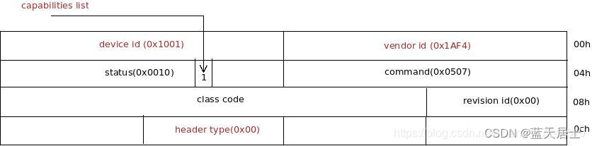
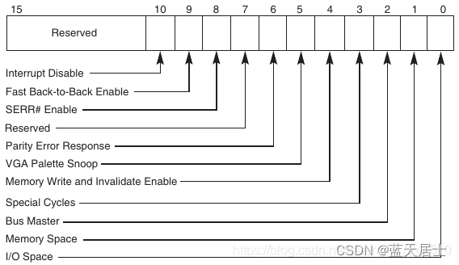
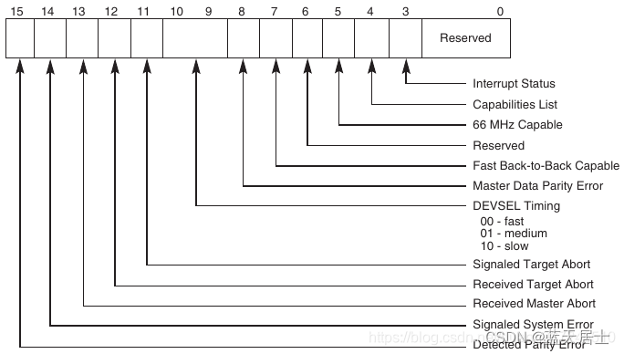
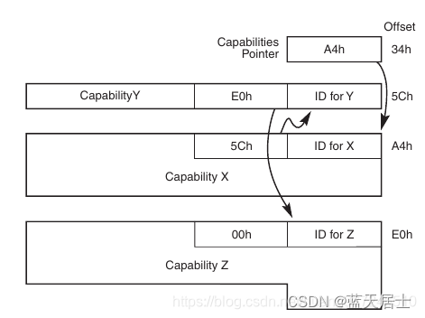
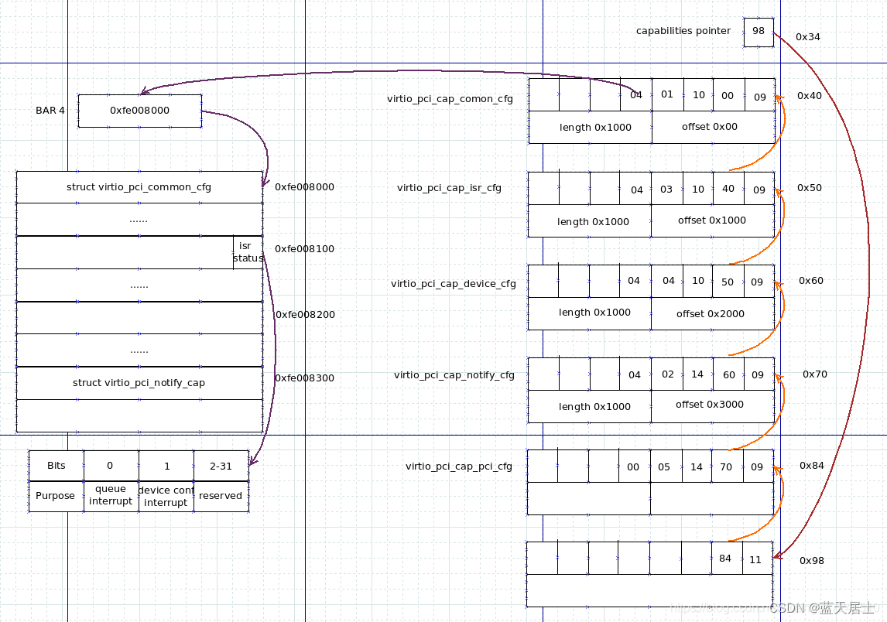

# virtio_pci

## PCI通用配置空间

### vendor id

virtio pci设备被redhat定义为0x1af4

### device id

- virtio-blk设备，0x1001

- ... ...

### revision id

virtio设备未使用

### header type

pci设备类型：

- 0x00表示普通设备

- 0x01表示pci bridge

- 0x02表示cardbus bridge

### command

### status

## virtio配置空间

### capability机制

virtio的相关配置都基于pci/pcie设备的capability机制，capability原理如下：

virtio使用capability链表指示相关cfg，然后通过capability链表元素中的offset和length定位capability数据在BAR 4中的位置。

要注意的是，capability链表元素本身还是存储在PCI配置空间中的。

### virtio实现的capability

virtio实现的capability有两种：

- MSI-X Capability，ID为0x11。

- vendor specific，ID为0x09。vendor specific又包含：
  
  - virtio_pci_cap_common_cfg
  
  - virtio_pci_cap_isr_cfg
  
  - virtio_pci_cap_device_cfg，可选，用于传递设备自定义的cfg
  
  - virtio_pci_cap_notify_cfg
  
  - virtio_pci_cap_pci_cfg

