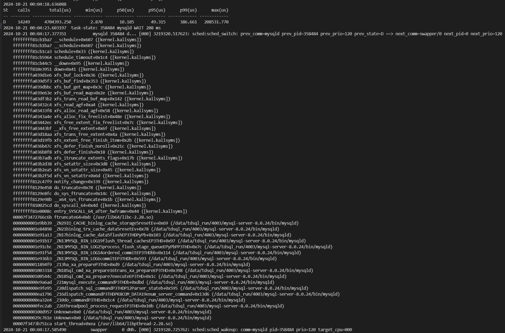
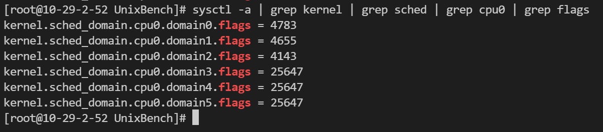
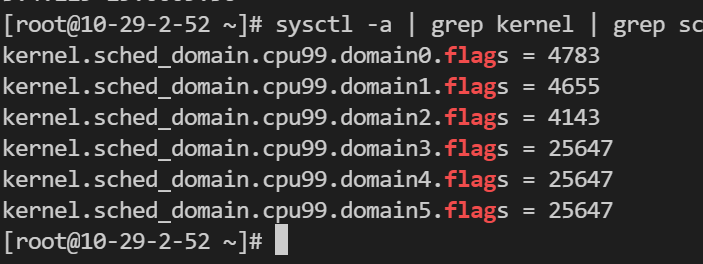

# 工作加速器

## 如何分析调度行为

```shell
perf sched 
```

## virt-install创建虚拟机

```shell
# 创建
virt-install --name ts31-genoa --vcpus 32 --ram 16384 --cdrom=xxx.iso --disk path=xxx.qcow2 --network=default --graphics vnc,listen=0.0.0.0

# 查询vnc端口
virsh vncdisplay <domain>
```

## qemu创建虚拟机

```shell
./qemu-system-x86_64 \
        -machine accel=kvm \
        -m 16G \
        -smp 8 \
        -cdrom /data/alexjlzheng/TencentOS-Server-3.1-20240715.1-TK4-x86_64-minimal.iso \
        -boot order=d \
        -drive file=/data/alexjlzheng/disk.qcow2,format=qcow2 \
        -vnc 0.0.0.0:1
```

## qemu启动虚拟机

```shell
./qemu-system-x86_64 \
        -machine accel=kvm \
        -D /data/alexjlzheng/qemu.log \
        -m 64G \
        -smp 128 \
        -object memory-backend-ram,id=mem0,size=32G \
        -object memory-backend-ram,id=mem1,size=32G \
        -numa node,cpus=0-63,memdev=mem0,nodeid=0 \
        -numa node,cpus=64-127,memdev=mem1,nodeid=1 \
        -drive file=/data/alexjlzheng/kernels/ts31.qcow2,format=qcow2,if=virtio \
        -drive file=/data/alexjlzheng/kernels/ts31.data.qcow2,format=qcow2,if=virtio \
        -netdev user,id=netdev0,hostfwd=tcp:127.0.0.1:36666-:22 \
        -device virtio-net-pci,netdev=netdev0,len-numaware-queue=2,numaware-queue[0]=1 \
        -serial file:/data/alexjlzheng/kernels/serial.log \
        -vnc 0.0.0.0:5
```

## 内核函数调用图

```shell
# 1. 进入 ftrace 目录
cd /sys/kernel/debug/tracing

# 2. 关闭当前的跟踪
echo 0 > tracing_on

# 3. 清空之前的跟踪记录
echo > trace

# 4. 设置要跟踪的函数为 SyS_openat
echo do_sys_openat > set_graph_function

# 5. 启用进程图选项，以便记录进程的调用图
echo 1 > options/funcgraph-proc

# 6. 保存当前的 CPU 掩码到一个文件（请替换为实际的文件名）
cat tracing_cpumask > 一个缓存文件

# 7. 设置跟踪的 CPU 掩码，通常设置为 1，表示只在 CPU 0 上进行跟踪
echo 1 > tracing_cpumask

# 8. 设置当前的跟踪器为 function_graph，用于记录函数调用图
echo function_graph > current_tracer

# 9. 开始跟踪
echo 1 > tracing_on

# 10. 在目标目录中执行测试（请替换为您要测试的目录）
cd 你要测试的目录
taskset -c 0 touch hahaha

# 11. 停止跟踪
echo 0 > tracing_on

# 12. 查看跟踪结果
cat trace
```

regs_return_value

regs_get_kernel_argument


xfs_ialloc_ag_select





0009.54 - 海光四号



0009.56 - 海光四号


